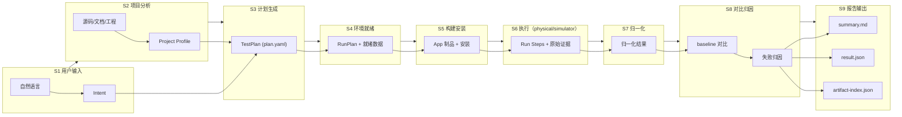

# iTestAgent 数据流全链路技术说明文档

## 1. 目的与范围

本文件从**数据视角**说明 iTestAgent 从"用户一句话"到"本地报告"的全链路数据如何产生、流转、转换、落盘与被消费。

- 读者：研发、QA、架构评审
- 视角：数据流（Data Flow），不是控制流；关注每一跳的输入/输出/格式/存储
- 形态约束：Local-first、TUI-first、真机与 iOS Simulator 同级支持；全流程本机
- 样例项目：无测试代码的项目示例（走 DeviceBackend 探索路径）

## 2. 数据流总览

全链路可归纳为九个阶段的数据转换：

```text
S1 用户输入(NL)        -> Intent
S2 项目源码/文档       -> Project Profile
S3 Intent + Profile    -> TestPlan
S4 TestPlan            -> RunPlan + 环境/设备就绪数据（含 targetKind）
S5 RunPlan             -> App 制品(physical .ipa / simulator .app) + 安装状态
S6 执行动作            -> Run Steps + 原始证据(截图/视频/日志/xcresult/trace)
S7 原始证据            -> 归一化结果(metrics/cases/assertions)
S8 归一化结果 + 历史   -> baseline 对比 + 失败归因
S9 结构化结果          -> summary.md / result.json / artifact-index.json
```

数据分三类：

```
控制数据   Intent / TestPlan / RunPlan / 权限决策
证据数据   截图 / 视频 / syslog / crashlog / xcresult / .trace
派生数据   Project Profile / metrics / baseline / 归因 / 报告 / Flow
```


```mermaid
flowchart LR
    subgraph S1["S1 用户输入"]
        NL["自然语言"] --> Intent["Intent"]
    end
    subgraph S2["S2 项目分析"]
        Code["源码/文档/工程"] --> Profile["Project Profile"]
    end
    subgraph S3["S3 计划生成"]
        Intent --> TestPlan["TestPlan (plan.yaml)"]
        Profile --> TestPlan
    end
    subgraph S4["S4 环境就绪"]
        TestPlan --> RunPlan["RunPlan + 就绪数据"]
    end
    subgraph S5["S5 构建安装"]
        RunPlan --> App["App 制品 + 安装"]
    end
    subgraph S6["S6 执行（physical/simulator）"]
        App --> RunSteps["Run Steps + 原始证据"]
    end
    subgraph S7["S7 归一化"]
        RunSteps --> Metrics["归一化结果"]
    end
    subgraph S8["S8 对比归因"]
        Metrics --> Baseline["baseline 对比"]
        Baseline --> Explain["失败归因"]
    end
    subgraph S9["S9 报告输出"]
        Explain --> Summary["summary.md"]
        Explain --> Result["result.json"]
        Explain --> Artifact["artifact-index.json"]
    end
    S1 --> S2 --> S3 --> S4 --> S5 --> S6 --> S7 --> S8 --> S9
```
## 4. 阶段 S1：自然语言 -> Intent

```
输入   用户在 TUI 输入的自然语言（多轮）
处理   engine 调 LLM(AI SDK) 解析意图
输出   Intent { goal, targetHint, targetKind?, deviceHint, features?, metricsHint?, scope }
存储   session 上下文（内存 + session 落盘）
```

要点：

```
- Intent 只是意图草稿，不直接执行
- 缺失关键信息（设备/目标）时在 TUI 追问补全
- Intent 与后续 TestPlan 解耦，便于多轮修改
```

## 5. 阶段 S2：项目 -> Project Profile

```text
输入   当前 workspace 源码/文档/工程配置/测试资产
处理   project-analyzer:
        XcodeProj + xcodebuild -list/-showBuildSettings 解析工程
        tier 1 受控静态扫描提取 Swift/ObjC 候选事实
        SwiftSyntax 可选增强 Swift 结构（tier 2）
        已有可用 build/index 时可用 sourcekit-lsp/SourceKitten 增强符号/语义（tier 3）
        读取 README/docs/埋点/API/文案
输出   ProjectAnalysisResult {
         profile,
         analysis{
           analysisTier, enabledCapabilities, limitations,
           executionAssets{
             status: available | none | indeterminate,
             configurations[{scheme,testPlan?,targets,targetKind,evidence,limitations}]
           }
         }
       }
       profile 内候选核心链路带证据+置信度；未启用增强能力必须显式标注
存储   ~/.itestagent/projects/<project-hash>/project-profile.json
```

`analysis` 是当次分析/Session 的能力元数据，不直接写入 `project-profile.v1`。未来若需持久化，必须提升 schemaVersion 并按 ADR-022 迁移。

Project Profile 数据契约（关键字段）：

```
{
  "projectHash": "sha256(workspace path + git head)",
  "app": {"name":"","bundleId":"","workspace":"","scheme":""},
  "features": [
    {"name":"login","entry":"LoginViewController",
     "keywords":["登录"],"testability":"device_backend",
     "requiresAccount":true,
     "evidence":["README#登录","LoginViewController.swift","埋点 login_click"],
     "confidence":0.72}
  ],
  "testAssets": {"hasXCUITest":false,"hasScheme":true},
  "suggestedSmoke": ["launch","login","search","checkout"]
}
```

要点：

```
- 工程结构字段是确定性解析结果，可信
- hasXCUITest 只表示工程图中存在 UI test target；hasScheme 只表示发现 scheme，二者均不能单独证明可执行
- XCUITest 结构候选由当次 analysis 通过 metadata-only 读取输出：scheme + Test action 中的 graph-proven XCUITest targets + 可选 test plan + 声明的 targetKind 相容性 + evidence/limitations；确认前不得执行 build/test/archive、scheme pre-action、项目 Run Script，也不得选择具体 destination 或安装 App/test runner
- executionAssets 必须显式输出 available/none/indeterminate；只有权威 none 才能支持 auto 选择 DeviceBackend，indeterminate 必须 blocked
- scheme 名称包含 test 不是可执行性证据；多个配置无法唯一确定时保留候选并在规划阶段询问
- features/suggestedSmoke 是推断结果，带 evidence + confidence
- 核心链路不自动断定，需用户在 TUI 勾选确认后才生效
- 敏感文件（.gitignore 命中/secrets/DerivedData）不纳入扫描
```

## 6. 阶段 S3：Intent + Profile -> TestPlan

```
输入   Intent + Project Profile + 用户确认的候选链路
处理   engine 仅使用 TUI 明确确认的候选链路编译 TestPlan（结构化、可审计、可复现）
       同时按 execution.prefer + executionAssets.status/configurations 解析执行路径
       多个可执行配置无法唯一确定时先询问；选择 XCUITest 时固化 scheme/test plan
       展示草稿后允许用户自然语言修改、确认或取消
输出   待确认 TestPlan；确认后才成为后续 S4-S9 的输入基线
存储   ~/.itestagent/runs/<run_id>/plan.yaml
```

TestPlan 数据契约（要点）：

```
mode: local
target: { type: current_workspace }
projectProfile: { source: project-profile.json }
device:
  kind: physical | simulator              # ADR-011 targetKind
  physical: { selector: local_connected | by_udid | by_name }
  simulator: { selector: booted | by_udid | by_name | create_from_profile }
appSource: { strategy: auto_from_workspace }
execution:
  prefer: auto | xcuitest | device_backend
  fallback: device_backend | abort
  resolvedPath: xcuitest | device_backend
  selectionReason: explicit_preference | evidence_backed_xcuitest | confirmed_no_xcuitest_candidate | user_selected_after_ambiguity
  xcuitest: { scheme: AppUITests, testPlan?: Smoke, targets?: [AppUITests] }
features: [login, checkout]
testData: { allowAgentGeneratedData: true, askUserInTuiWhenRequired: true }
assertion: { policy: user_goal_then_profile_then_agent_confirmed }
metrics: [launch_time, memory_peak, crash, test_duration, hitches, fps, xctrace_summary]
performance:
  baseline: local_auto
  baselineDomain: physical | simulator   # ADR-011 分域隔离
  thresholdRequired: false
artifacts: [screenshot, video, syslog, crashlog, xcresult, trace]
report: { outputs: [summary_md, result_json, artifact_index_json] }
```

要点：

```text
- 未确认候选不得进入 TestPlan；过滤后为空时显式阻断，不得回退到未确认 suggestedSmoke
- prefer=device_backend 尊重显式选择；prefer=xcuitest 缺少唯一证据候选时 blocked，不得降级
- prefer=auto 仅在 status=available 且唯一/明确默认候选时选择 XCUITest；只有 status=none 时选择 DeviceBackend；indeterminate 必须 blocked；多个歧义候选先询问
- fallback=device_backend 仅表示 auto 在规划阶段权威确认没有 XCUITest 候选，不表示 XCUITest 执行失败后的降级
- `itestagent.test-plan.v3` canonical writer 必须写入 resolvedPath/selectionReason；resolvedPath=xcuitest 时必须写入 xcuitest.scheme
- 旧 v1/v2 TestPlan 只在现有字段可无歧义推出路径时由 ADR-022 compatibility reader 迁移为 v3；否则返回 typed issue，不猜测
- 确认界面展示 resolved path、selection reason、scheme/test plan 与 limitations
- 自然语言修改保留同一 runId 与 Project Profile 引用，重新执行 schema 校验
- 未确认或已取消的 TestPlan 不得进入 S4；确认后的 TestPlan 才是全链路“单一事实源”
- 普通多轮追问沿用当前规划周期，不得隐式调用新规划；第一版 TUI 通过 `/plan <test goal>` 显式开启新周期，并原子替换旧 Intent、候选与草稿
- 规划状态对外以不可变快照暴露；草稿、证据与已确认 TestPlan 的外部修改不得反向改变 session 内部状态
- 当前规划周期一旦取消不得原地恢复；如需继续，必须创建新的规划周期并重新完成候选与计划确认
```

## 7. 阶段 S4：TestPlan -> RunPlan + 就绪数据

```
输入   TestPlan
处理   读取已确认 TestPlan 的执行路径 + doctor 环境检查 + 设备 healthcheck + 权限评估
       重新验证已选 scheme/test plan/destination 或 DeviceBackend readiness
输出   RunPlan（含解析后的设备、已确认执行路径、重新验证结果）+ 就绪状态数据
存储   run metadata（SQLite） + run_id 目录
```

就绪数据（写入 run metadata）：

```
env: { xcode, clt, backend, devicectl, simctl, xctrace 版本 }
device:
  physical: { name, model, os, udid, battery, trust, developerMode }
  simulator: { name, deviceTypeIdentifier, runtimeIdentifier, udid, state, targetKind }
targetKind: physical | simulator
permissionDecisions: [{action, resource, effect}]
readiness: pass | blocked(reason)
```

要点：

```text
- 不满足签名/DeveloperMode/信任/backend 前置（physical）-> readiness=blocked
- Simulator readiness: Xcode runtime 缺失、simctl 不可用、无可启动 Simulator → readiness=blocked
- 签名/DeveloperMode/信任对 Simulator 标记为 N/A（ADR-011）
- 版本信息随 run 落盘，用于跨版本问题追溯
- S4 不重新选择执行路径；已选配置消失、歧义或不相容时 readiness=blocked，要求修改并重新确认 TestPlan
- XCUITest readiness 校验 scheme/Test action/test plan/destination/build/signing，不依赖 Appium/WDA
- XCUITest scheme/Test action/test plan 的重验继续使用 metadata-only 读取，不得执行工程脚本
- 工程 build/test action 必须在计划确认及 `execute_project_build` 权限后执行；具体 destination、签名/provisioning 与安装还必须通过 `replace_device_app`
- analyzer/readiness 异常必须形成带已选 path 与空 fallback history 的结构化 blocked/failed 结果，不得逸出 dispatcher 或切换路径
- DeviceBackend readiness 校验 AUT 与所选 backend；选择 Appium 时才要求 ADR-028 WDA active readiness
```

## 8. 阶段 S5：RunPlan -> 路径专属执行准备

```text
输入   RunPlan(appSource) + 项目 workspace
处理   路径 A（XCUITest）：验证 scheme/Test action/test plan/destination/签名，App 构建安装由 S6 xcodebuild test 驱动，不启动 Appium/WDA
      路径 B（DeviceBackend）：App 来源优先级：用户指定 > 已有产物 > xcodebuild 构建
      .ipa 在 iTestAgent 管理目录受控解包并唯一解析 Payload/*.app；所有来源统一验证 targetKind/destination、bundleId、架构与签名
      构建日志经 xcbeautify；签名经 fastlane（必要时）
      R7 确认后由 devicectl 将已验证 .app 安装到本机 iPhone
      选择 Appium 时，WDA/Appium 通过 route-specific launch + /status 或等价 session probe 主动验证；失败后确认重签/重装并复验
输出   路径 A：已验证 XCUITest 配置与 destination readiness
       路径 B：归一化 App 制品路径 + 安装状态 + backend readiness（Appium 含 WDA route/probe/failure stage）+ 构建日志
存储   artifacts/logs/xcodebuild.log；产物路径记入 run metadata
```

数据要点：

```text
- 构建失败 -> infra_failed，携带首个错误+修复建议
- 记录 bundleId、构建配置、destination（platform+UDID）、dSYM 路径（供符号化）
- physical .ipa 安装到 Simulator 或 Simulator .app 安装到真机 → blocked，明确报错
- DeviceBackend 选择 Appium 时，WDA 已安装不能产生 ready；launch/tunnel/status/session 任一主动探测失败均 fail-closed，不得静默切换 WDA route
- XCUITest 路径不以 Appium/WDA ready 为前置；scheme/test plan/destination 失效时 blocked，不得转探索
- 重签、覆盖安装、重装或卸载前必须有 R7 确认；免费账号三 App 上限不得自动卸载
```

## 9. 阶段 S6：执行 -> Run Steps + 原始证据

```text
输入   已确认路径的 readiness + RunPlan + 测试数据（路径 B 另含已安装 App）
处理   路径A: execute_project_build 权限后执行 xcodebuild test（已确认 TestPlan 锁定证据候选）
  路径B: DeviceBackend 探索（显式选择，或 auto 收到权威 status=none）
  runner 通过 backend 接口执行动作并采集
输出   Run Steps（结构化）+ 原始证据文件
存储   SQLite(steps 元数据) + artifacts/（大文件）
```

Run Step 数据契约：

```
{
  "stepId":"s3",
  "action":"tap",
  "target":"登录",
  "locator":{"strategy":"label","value":"登录"},
  "status":"ok",
  "startedAt":"...","durationMs":320,
  "artifacts":["screenshot_s3","uitree_s3"]
}
```

原始证据类型与来源：

```
screenshot / video      backend 录制
uitree                  backend accessibility 快照
syslog                  devicectl / pymobiledevice3
crashlog                设备 crash report（可符号化）
xcresult                xcodebuild test 产物
.trace                  xcrun xctrace record
```

要点：

```
- 测试数据流：Agent 生成的安全数据可入 step；真实账号/OTP 只在内存注入，不写入 step/日志
- Simulator 探索与真机探索使用相同的 DeviceBackend 接口，RunStep 记录 targetKind
- 不支持的操作（真机独有的传感器/生物识别）标记为 blocked
- 探索路径的 steps 可固化为 iTestAgent Flow（可重放）
- 任一路径开始后，其构建/执行/解析失败保留为该路径结果；跨路径重试必须修改或新建 TestPlan 并重新确认
```

## 10. 阶段 S7：原始证据 -> 归一化结果

```
输入   xcresult / .trace / 日志 / 截图 / steps
处理   parser adapter:
        xcresultparser/xcparse 解析 xcresult -> cases/duration/attachments
        xctrace export --toc/--xpath 解析 -> hitches/hangs/(launch/memory)
        crashlog 符号化（xctrace symbolicate / LLVM）
        归一化为统一指标/用例/断言结构
输出   归一化结果对象
存储   result.json（部分）+ SQLite
```

归一化指标契约（含 targetKind 语义）：

```
{
  "metrics": {
    "launchTimeMs": 1320,
    "memoryPeakMb": 418,
    "testDurationMs": 54000,
    "crashCount": 0,
    "hitches": {"count":3,"maxMs":180},
    "fps": {"avg":57.4,"min":42,"approximate":true},
    "xctrace": {"summaryAvailable":false,"traceArtifactId":"time_profiler_trace"},
    "targetKind": "physical",
    "environment": "physical"
  },
  "simulatorMetrics": {                           // ADR-011 Simulator performance domain
    "representativeOfPhysicalDevice": false,
    "comparisonScope": "simulator_only",
    "hostFingerprint": "macOS-15.2-arm64-xxx",
    "xcodeVersion": "16.2"
  },
  "cases": [{"id":"login","status":"passed","durationMs":12400}]
}
```

要点：

```
- xctrace summary 归一化字段 { metric_name,start,duration,value,process,thread,source_schema,export_status }
- 不可导出的数据显式标 not_exportable，不编造
- FPS 标 approximate=true；memory 标近似
```

## 11. 阶段 S8：结果 + 历史 -> baseline 对比 + 归因

baseline 数据流：

```
输入   本次归一化 metrics + 历史 baseline
处理   首次成功 run -> 建立 baseline（功能失败/crash 不建）
      后续 run -> 与 baseline 对比，输出趋势
输出   baseline 对比结果（delta/%）
存储   ~/.itestagent/baselines/<project-device>/{launch_time,memory,hitches,fps}.json
```

baseline 记录契约：

```
{
  "key":"<project>|physical|iPhone15Pro|iOS18.2|checkout",
  "targetKind":"physical",
  "launchTimeMs":1244,
  "memoryPeakMb":360,
  "hitches":{"count":1},
  "updatedFromRun":"run_20260710_001"
}
// Simulator baseline 示例：
{
  "key":"<project>|simulator|iPhone-15-Pro|iOS-18-2|checkout",
  "targetKind":"simulator",
  "launchTimeMs":890,
  "memoryPeakMb":210,
  "hitches":{"count":0},
  "comparisonScope":"simulator_only",
  "representativeOfPhysicalDevice":false,
  "hostFingerprint":"macOS-15.2-arm64",
  "xcodeVersion":"16.2",
  "updatedFromRun":"run_20260710_002"
}
```

失败归因数据流：

```
输入   Project Profile + TestPlan + steps + xcresult + 截图/视频 + 日志 + crashlog + trace summary + 历史 run
处理   engine(LLM + 规则) 生成归因

输出   explanation { type, confidence, evidence[ ], suggestedActions[ ] }

存储   result.json.explanation
```

归因类型枚举：

```
product_regression / script_issue / device_issue / env_issue / flaky / perf_regression / inconclusive
```

要点：

```
- 证据不足时 type=inconclusive，不臆造
- 归因引用具体 artifactRefs 作为依据
```

## 12. 阶段 S9：报告合成与消费

```
输入   归一化结果 + baseline 对比 + 归因 + artifact 索引
处理   report adapter 合成三件套
输出   summary.md / result.json / artifact-index.json
存储   ~/.itestagent/runs/<run_id>/
消费   TUI 展示、itestagent explain、rerun、后续趋势分析
```

result.json 顶层契约：

```
{
  "runId":"run_20260710_001",
  "status":"failed",
  "projectProfileRef":"projects/<hash>/project-profile.json",
  "device":{"name":"iPhone 15 Pro","os":"18.2","udid":"xxx","targetKind":"physical"},
  "execution":{"mode":"device_backend","targetKind":"physical","flowId":"login_smoke_generated"},
  "environment":{                                         // ADR-011
    "targetKind":"physical",
    "representativeOfPhysicalDevice":true,
    "comparisonScope":"physical_only",
    "xcodeVersion":"16.2"
  },
  "metrics":{},
  "baselineDelta":{"launchTimeMs":"+6.2%","memoryPeakMb":"+16.3%"},

  "cases":[ ],

  "artifactRefs":["screenshot_failure","time_profiler_trace","syslog_main"],
  "explanation":{"type":"product_regression","confidence":0.86,"summary":"登录后首页未出现"}
}
```

artifact-index.json 契约：

```
{
  "runId":"run_20260710_001",
  "artifacts":[
    {"id":"screenshot_failure","type":"screenshot","path":"artifacts/screenshots/failure.png","relatedStep":"tap_login"},
    {"id":"time_profiler_trace","type":"trace","path":"artifacts/traces/time-profiler.trace","template":"Time Profiler"},
    {"id":"syslog_main","type":"syslog","path":"artifacts/logs/syslog.log"}
  ]
}
```

## 13. 数据落盘与存储分工

```
SQLite(metadata)   Project/Session/Run/Step/Flow/Baseline（分域）/Permission 索引与状态
文件系统(artifacts) 截图/视频/日志/xcresult/trace/crashlog 等大文件
                   simulator artifacts 独立目录（每个 session 独立 wdaLocalPort/derivedDataPath）
JSON/YAML(可读产物) project-profile.json / plan.yaml / result.json / artifact-index.json / summary.md
Keychain           记住的账号/token（可选，加密）
```

原则：

```
- SQLite 存“指针+状态+指标”，文件系统存“大体积证据”，result.json 用 artifactRefs 引用
- 每个 run 自包含（目录内可独立复现/审计）
- schema 版本化，跨版本可迁移
```

## 14. 缓存、增量与幂等

```
Project Profile 缓存   按 project-hash（路径+git head）缓存；源码变更失效重算
索引复用             若已有可用 build/index，tier 3 SourceKit 可复用 index store；缺失时显式降为较低 analysisTier
构建产物复用          已有最新产物且未变更时跳过重建
重跑幂等             rerun --failed-only 复用原 TestPlan/数据，仅重放失败用例
baseline 增量        仅成功 run 更新，避免脏数据污染趋势
```

## 15. 敏感数据流与脱敏

```
真实账号/OTP/token   TUI 输入 -> 仅内存注入执行 -> 不写 step/日志/报告
记住凭证             用户显式确认 -> macOS Keychain（加密），不写 JSONC 明文
日志脱敏             syslog/backend 日志入库前做敏感字段脱敏
报告脱敏             summary/result 不含密码/token/验证码原文
截图/视频            可能含敏感界面 -> 本地存储且标注 raw-local-only，不自动脱敏；可进入报告 artifact 引用，不外传；提供清理命令
```

敏感数据流向图：

```
┌──────────┐     ┌─────────────┐     ┌──────────────┐     ┌─────────────┐
│ TUI 输入  │────▶│ 仅内存注入   │────▶│ 执行 adapter  │────▶│ step/日志    │
│ 账号/OTP  │     │ 不落盘       │     │ backend 调用  │     │ 脱敏后入库   │
└──────────┘     └─────────────┘     └──────────────┘     └─────────────┘
                        │                                          │
                        ▼                                          ▼
                 ┌─────────────┐                          ┌─────────────┐
                 │ Keychain     │                          │ 报告三件套    │
                 │ 用户确认后存 │                          │ 不含密码/token│
                 └─────────────┘                          └─────────────┘
                        │                                          │
                        ▼                                          ▼
                 ┌─────────────┐                          ┌─────────────┐
                 │ JSONC 配置    │                          │ 截图/视频     │
                 │ 不存明文凭证  │                          │ 本地存储不外传│
                 └─────────────┘                          └─────────────┘
```

脱敏边界：

```
TUI 输入 → 内存 only（不写 step/日志/报告/JSONC）
Keychain → 加密存储（macOS security CLI）
syslog/backend 日志 → 入库前脱敏（正则替换账号/OTP/token 模式）
summary.md / result.json → 不含密码/token/验证码原文
截图/视频 → 本地 artifacts/ 存储，redactionStatus=raw-local-only（不要求自动脱敏：真机截图内容脱敏在技术上不可行。截图以 raw 形态进入 artifact-index.json 并被 summary.md / result.json 引用，但不会离开本机或嵌入为 base64）
```

## 16. 错误与降级数据流

```
构建/签名失败   -> infra_failed，记录首错+修复建议
设备不就绪（physical）-> readiness=blocked，中止链路
设备不就绪（simulator）-> readiness=blocked（runtime 缺失/simctl 不可用/无可用设备）
backend 不支持 targetKind -> backend_capability_unsupported，尝试同类型 fallback
跨 targetKind fallback  -> 必须用户确认（allowCrossTargetFallback），否则 blocked
探索不可判定    -> case.status=explored/inconclusive/needs_assertion
性能不可导出    -> metric.export_status=not_exportable，保留原始 .trace
归因证据不足    -> explanation.type=inconclusive
```

原则：任何降级都在数据中显式标注，不静默、不编造；报告中如实呈现限制。

## 17. 数据保留与生命周期

```
runs/<run_id>     默认保留；提供清理/保留策略（按数量/天数）
artifacts         大文件可配置定期清理；result.json 保留引用
baselines         长期保留；可被用户接受的新 run 更新
Project Profile   随项目变更刷新；可固化到项目
Keychain 凭证     用户可随时清除
```

## 18. 数据契约版本化

```
- 所有对外 JSON/YAML 带 schemaVersion
- result.json / artifact-index.json / project-profile.json / plan.yaml / flow.yaml 独立版本演进
- ADR-011 targetKind 引入：result/flow 升级到 v2；ADR-029 将 test-plan 升级到 v3 以固化 resolvedPath/selectionReason；config 保持兼容
- v1→v2 reader 将历史数据迁移为 targetKind=physical（writer 禁止输出无 targetKind 文档）
- test-plan v2→v3 reader 仅在路径可无歧义推出时迁移；歧义返回 typed migration issue，v3 writer 禁止省略 resolvedPath/selectionReason
- 解析层对老版本做兼容读取
- xctrace/xcresult 输出随 Xcode 变化，backend 做 schema 容错并记录 source_schema
```

## 19. 端到端数据流示例（以某无既有测试项目为例）

```
用户: “帮我在本机 iPhone 上测登录，失败就分析原因”
S1 Intent { goal: 测登录, deviceHint: local }
S2 分析项目 .xcworkspace -> Profile(无 XCUITest, 候选链路: 启动/登录)
S3 TestPlan(execution.prefer=auto, resolvedPath=device_backend, selectionReason=confirmed_no_xcuitest_candidate, metrics=[launch,memory,crash,hitches])
S4 doctor+healthcheck 通过; 权限: 安装/启动 allow
S5 xcodebuild 构建 -> devicectl 安装
S6 DeviceBackend: launch -> tap 登录 -> 输入(TUI 提供账号) -> 断言 首页
   采集 screenshot/video/syslog/.trace; 记录 run steps
S7 解析: 登录后首页未出现 -> case=failed; metrics 归一化
S8 baseline: 首次 -> 建立; 归因: product_regression conf 0.86
S9 输出 summary.md/result.json/artifact-index.json; TUI 展示结论与下一步

Simulator 端到端示例：
用户: "帮我在 Simulator 上测登录"
S1 Intent { goal: 测登录, targetKind: simulator }
S2 分析项目 → Profile（无 XCUITest）
S3 TestPlan(device.kind=simulator, baselineDomain=simulator)
S4 Simulator readiness: Xcode runtime + simctl check 通过; 签名 N/A
S5 xcodebuild -destination 'platform=iOS Simulator,id=UDID' → simctl install
S6 AppiumDeviceBackend(simulator adapter): launch → tap → input → assert
    RunStep.targetKind=simulator
S7 metrics.environment=simulator, representativeOfPhysicalDevice=false
S8 baseline: simulator_only domain, 不与 physical baseline 比较
S9 报告标注 comparisonScope=simulator_only
```

## 20. 小结

```
- 控制数据（Intent/TestPlan/RunPlan/权限）驱动流程，TestPlan 为单一事实源
- 证据数据（截图/视频/日志/xcresult/trace）走文件系统，索引入 result/artifact-index
- 派生数据（Profile/metrics/baseline/归因/报告/Flow）为可复现结论
- baseline 按 targetKind 分域隔离；physical ↔ simulator 跨域比较在 Store/Schema 层被拒绝
- 敏感数据只在内存流转，落盘必脱敏或进 Keychain
- 任何不确定/不可导出/降级都在数据中显式标注，绝不静默编造
```
## 迁移对齐（B39 同步）

B04/B05/B37 已覆盖 config-v1/result-v1/artifact-index-v1/test-plan-v2 与既有 migrations，registry shadow-read（B36）保证该历史基线的 compile-time 一致性。ADR-029 已批准 test-plan-v3（resolvedPath/selectionReason）作为 T6.5 canonical 目标；在 T6.5 实现、迁移测试与 schema parity 完成前，不得宣称 v3 已落地。
