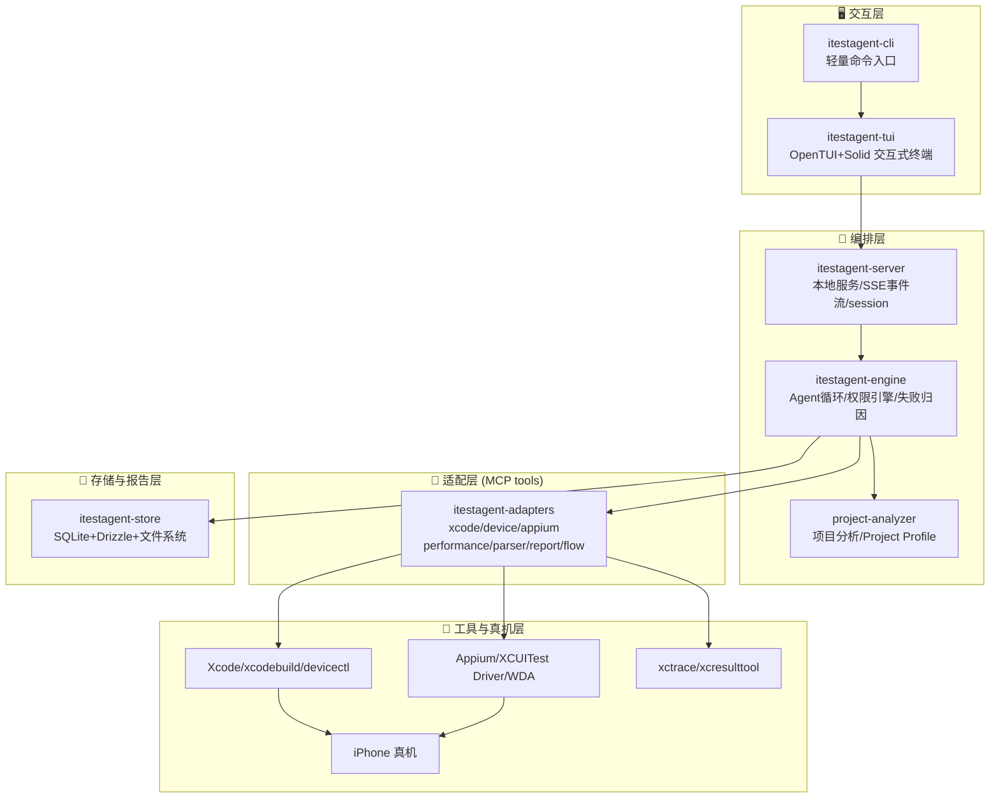
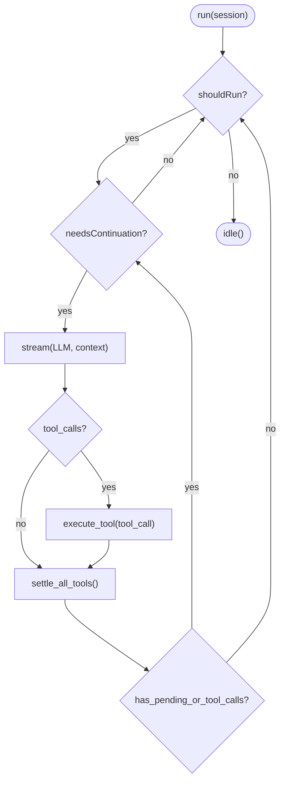
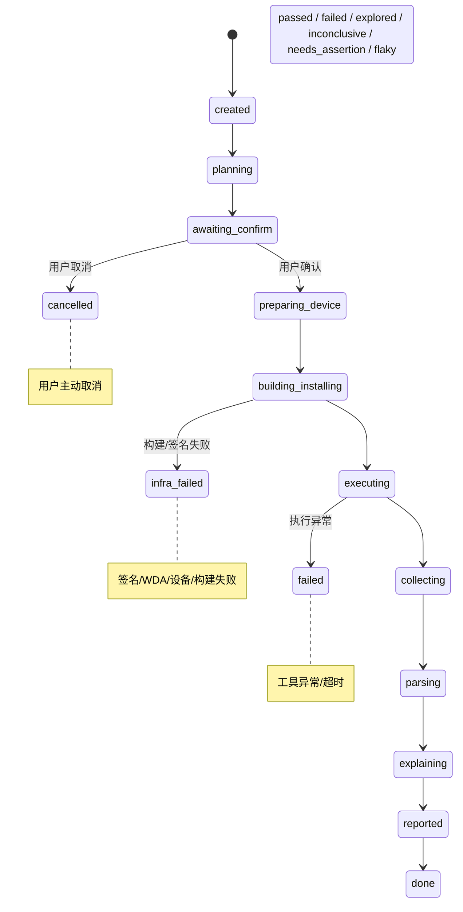
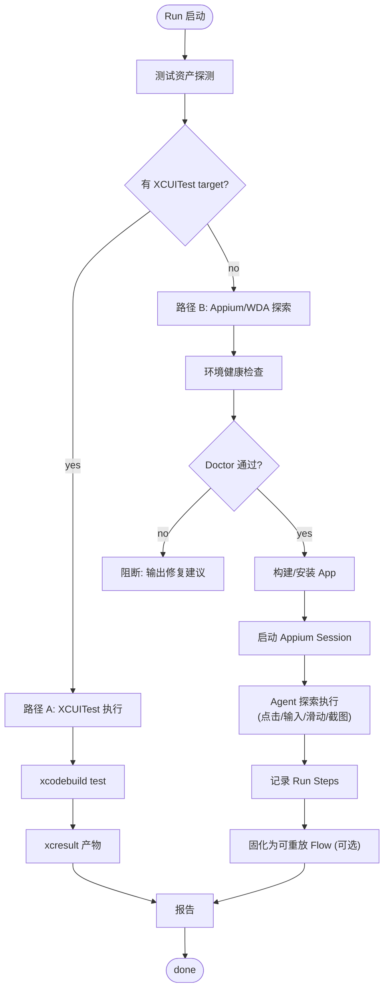

# iTestAgent 架构设计文档

## 1. 文档目的与范围

本文件给出 iTestAgent 的系统架构设计，覆盖分层结构、组件职责、模块边界、数据模型、关键流程、并发与错误处理、技术选型、复用策略、安全与非功能需求。

- 面向对象：研发、架构评审、QA
- 产品形态：Local-first、TUI-first、只面向 iPhone 真机的测试 Agent
- 目标用户：iOS 客户端开发者本地自测与失败复现
- 范围：本机单机架构（第一版）；中心化/云真机为可选扩展，不在第一版实现

## 2. 架构目标与约束

架构目标：

```
1. TUI-first：交互式终端是核心界面，CLI 只作轻量入口
2. Local-first：全流程本机运行，无需登录、服务器、云真机
3. Project-aware：先理解 iOS 项目，再生成测试计划
4. Real-device-first：第一版重点面向本机 USB 连接的 iPhone 真机
5. 复用优先：底层能力尽量复用成熟 repo，自研聚焦编排与语义层
6. Backend-pluggable：底层工具可替换，上层语义和产物不随工具变化
7. 可审计可复现：每次运行结构化落盘，run 可追踪、可重跑
8. 安全可控：危险操作二次确认，敏感数据不落盘明文
```

核心架构原则：

```
稳定的是 iTestAgent 语义层：ProjectProfile / TestPlan / RunStep / Flow / ArtifactRef / result.json
可变的是 backend：mobile-mcp / Appium / iphone-use / XcodeTraceMCP / XcodeQuery / Drizzle / Kysely 等
engine 不直接拼底层命令，只调用内部 backend 接口
backend 只负责执行能力，不负责决定测试策略
所有 backend 输出归一化为 iTestAgent 自己的数据契约
```

架构约束：

```
- 依赖 macOS + Xcode 工具链
- 依赖签名/Provisioning/Developer Mode/设备信任等真机前置条件
- 探索式执行默认不保证可复现，只有固化为 Flow 后可复现
- 性能指标以 hitches/hangs 为主，FPS 为近似，深度 xctrace 解析为实验性
```

## 3. 分层架构总览

```
交互层        itestagent-cli / itestagent-tui
编排层        itestagent-server / itestagent-engine / project-analyzer
语义层        ProjectProfile / TestPlan / RunStep / Flow / ArtifactRef / result.json
Backend接口层  DeviceBackend / PerformanceBackend / BuildDriver / ProjectAnalyzerBackend / StoreDriver / AgentRuntime
Backend实现层  mobile-mcp / Appium-WDA / iphone-use / XcodeTraceMCP / instrumentsmcp / raw-xcrun / XcodeQuery / XcodeProj / Drizzle / Kysely
存储与报告层  SQLite metadata / filesystem artifacts / result.json / artifact-index.json / summary.md
```

设计原则：

```
- 单向依赖：上层依赖下层，下层不反向依赖上层
- engine 不直接拼底层命令，一律经 backend 接口
- backend 实现可替换：同一个 DeviceBackend 接口可有 mobile-mcp、Appium、mock 等实现
- 存储层是唯一持久化出口，其他层不直接写磁盘（除 runner 采集临时产物）
- backend 选择策略：用户显式指定 > 偏好顺序 > healthcheck 通过 > fallback（需记录）
```

## 4. 系统架构图



| 组件                | 职责                                                         | 依赖                         | 不做                |
| ------------------- | ------------------------------------------------------------ | ---------------------------- | ------------------- |
| itestagent-cli      | 启动 TUI、一次性命令、doctor/devices/config/version          | tui, server                  | 不承载测试主流程    |
| itestagent-tui      | 交互式界面、展示计划/进度/结果、收集用户确认与输入           | server 事件流                | 不直接调用底层工具  |
| itestagent-server   | 长任务、事件流、session 状态、子进程生命周期                 | engine                       | 不含业务测试语义    |
| itestagent-engine   | 意图理解、TestPlan 编译、Agent 循环、backend 调度、失败归因  | AgentRuntime, backends, store | 不直接拼 shell 命令 |
| project-analyzer    | 扫描代码/文档/测试资产，生成 Project Profile 与候选链路      | ProjectAnalyzerBackend       | 不自动断定核心链路  |
| AgentRuntime        | 抽象 AI SDK / Mastra / LangGraph 等 agent loop backend       | LLM provider                 | 不关心具体设备工具  |
| PermissionEngine    | allow/ask/deny、危险操作拦截、记忆规则                       | —                            | 不绕过用户确认      |
| RunStateMachine     | Run 生命周期、错误等级、暂停/恢复/取消                       | —                            | 不执行工具          |
| DeviceBackend       | 真机操作统一接口（listDevices/launchApp/tap/截图/UI tree 等） | 底层工具                      | 不决定测试目标      |
| PerformanceBackend  | trace 录制/导出/摘要/baseline 对比                           | xctrace/tools                | 不伪造不可导出指标  |
| BuildDriver         | 构建、签名、安装前产物生成、日志格式化                       | xcodebuild/tools             | 不决定测试策略      |
| StoreDriver         | SQLite metadata、migrations、transaction                     | bun:sqlite                   | 不存大文件 blob     |
| ArtifactStore       | 截图/视频/日志/trace/xcresult 文件落盘与索引                 | 文件系统                     | 不把敏感内容外传    |
| SecretStore         | 敏感数据存取（内存/Keychain）                                | macOS security CLI           | 不写 JSONC 明文     |

模块边界原则：

```
- engine 与 adapters 之间只通过 tool 接口通信（inputSchema/outputSchema）
- adapters 之间不互相直接调用，由 engine/runner 编排
- 真机工具的版本差异由 adapters 吸收（如 xctrace 跨 Xcode 容错）
- store 提供统一读写 API，schema 版本化
```

## 5.1 Backend 接口设计

### DeviceBackend

```typescript
interface DeviceBackend {
  readonly name: string;
  readonly capabilities: BackendCapabilities;
  listDevices(): Promise<DeviceInfo[]>;
  healthcheck(deviceId: string): Promise<HealthCheckResult>;
  launchApp(input: LaunchAppInput): Promise<ActionResult>;
  getUiTree(input: DeviceTarget): Promise<UiTreeSnapshot>;
  screenshot(input: ScreenshotInput): Promise<ArtifactRef>;
  tap(input: TapInput): Promise<ActionResult>;
  swipe(input: SwipeInput): Promise<ActionResult>;
  typeText(input: TypeTextInput): Promise<ActionResult>;
  startRecording(input: RecordingInput): Promise<RecordingHandle>;
  stopRecording(input: RecordingHandle): Promise<ArtifactRef>;
  collectLogs(input: LogCollectInput): Promise<ArtifactRef>;
}
```

实现候选：`MobileMcpBackend`（MVP 第一候选）、`AppiumBackend`（长期标准）、`IphoneUseBackend`（视觉 fallback）、`MockBackend`（无真机开发/CI）。

### PerformanceBackend

```typescript
interface PerformanceBackend {
  recordTrace(input: TraceRecordInput): Promise<ArtifactRef>;
  exportTrace(input: TraceExportInput): Promise<TraceExportStatus>;
  summarizeTrace(input: TraceSummaryInput): Promise<TraceSummary>;
  symbolicate(input: SymbolicateInput): Promise<ArtifactRef>;
  compareBaseline(input: BaselineCompareInput): Promise<BaselineDelta>;
}
```

实现候选：`XcodeTraceMCP core`（MVP 第一候选）、`instrumentsmcp`（一体化 profiling）、`raw-xcrun-minimal`（fallback）、`instruments-analyzer-duckdb`（Phase 6+ 深度分析）。

### BuildDriver

```typescript
interface BuildDriver {
  doctor(): Promise<BuildDoctorResult>;
  listSchemes(root: string): Promise<SchemeInfo[]>;
  build(input: BuildInput): Promise<BuildResult>;
  test(input: TestInput): Promise<TestResult>;
}
```

实现候选：`xcodebuild-native`（MVP 默认）、`fastlane`（签名复杂时启用）、`codemagic-cli-tools`（可选 driver）。

### ProjectAnalyzerBackend

```typescript
interface ProjectAnalyzerBackend {
  discover(root: string): Promise<ProjectDiscovery>;
  graph(input: ProjectDiscovery): Promise<ProjectGraph>;
  buildSettings(input: BuildSettingsQuery): Promise<ResolvedBuildSettings>;
  scanSources(input: SourceScanInput): Promise<SourceFacts>;
}
```

实现候选：`XcodeQuery CLI`（JSON backend 强候选）、`XcodeProj helper`（成熟方案）、`raw-xcodebuild`（官方事实源）、`SwiftSyntax`（结构解析）。

### 统一数据契约

所有 backend 输出归一化为 iTestAgent 自有类型：

| 类型 | 用途 |
|---|---|
| `DeviceSnapshot` | 设备信息（platform/deviceType/model/osVersion/backend） |
| `UiTreeSnapshot` | UI 树快照（sourceType/elements/completeness/warnings） |
| `DeviceActionResult` | 操作结果（status/backend/error{retryable}/artifacts） |
| `RunStep` | 执行步骤（stepId/backend/action/target/result/safetyGate） |
| `ArtifactRef` | 证据引用（id/type/path/sizeBytes/sha256/redactionStatus） |
| `PerformanceMetrics` | 性能指标（launchTimeMs/hitches/hangs/fpsLike/exportStatus） |

## 5.2 Backend 选择策略

```
execution:
  backendPreference:
    device:       [mobile-mcp, appium, iphone-use, mock]
    performance:  [xctrace-analyzer-core, instrumentsmcp, raw-xcrun-minimal]
    build:        [xcodebuild-native, fastlane, codemagic-cli-tools]
    projectAnalyzer: [xcodequery, xcodeproj-helper, raw-xcodebuild]
  fallbackPolicy: ask_user
```

选择规则：
1. 用户显式指定 backend 时优先。
2. 未指定时按 preference 顺序。
3. backend healthcheck 不通过则尝试下一个。
4. fallback 会改变测试语义时必须询问用户。
5. 所有 fallback 必须记录到 result.json。

## 6. Agent 编排内核

编排循环（自建，照搬 OpenCode 模式，用 AI SDK 实现）：



伪代码：
```
run(session):
  while shouldRun:
    while needsContinuation:
      turn = stream(LLM, context)         # 一次 provider 调用
      for tool_call in turn:              # 执行工具
        result = execute_tool(tool_call)
        needsContinuation = true
      await settle_all_tools()
      needsContinuation = has_pending_or_tool_calls()
    shouldRun = has_queued_input()
  idle()
```

关键点：

```
- 使用 Vercel AI SDK 多步 tool-calling（streamText + onStepFinish/toolCalls）
- iPhone 真机能力以 MCP tools 暴露给循环
- 工具抽象 { description, inputSchema, outputSchema, execute } + 输出大小限制
- idle = 无工具调用 且 无 pending 输入
- 不引入 Effect / 事件溯源等重型依赖，状态用内存 + JSON/SQLite
```

权限引擎：

```
规则模型 { action, resource, effect: allow | deny | ask } + 通配符
ask -> 阻塞等待 TUI 确认；always -> 持久化记忆规则
deny -> 阻止；用户拒绝 -> 停止本次循环
高风险操作默认 ask：清数据/卸载重装/写项目/存账号/更新baseline/覆盖Flow/生成草稿
```

## 7. 数据模型

核心实体（SQLite + Drizzle 存 metadata，文件系统存大 artifact）：

```
Project        项目画像元数据（project-hash, app, features, testAssets）
Session        一次交互会话
Run            一次测试执行（run_id, status, device, execution, metrics）
Step           run 内的执行步骤（run steps）
Flow           可重放 iTestAgent Flow（flowId, source, status, steps）
Baseline       本地性能基线（按 项目+设备型号+iOS+scenario）
Artifact       文件型证据索引（type, path, relatedStep）
Permission     记忆的权限规则（action, resource, effect）
```

关键 JSON schema（对外产物）：

```
project-profile.json  app/features/testAssets/suggestedSmoke
plan.yaml             TestPlan（target/device/execution/metrics/report...）
result.json           run 状态/设备/执行方式/指标/baseline对比/artifactRefs/归因
artifact-index.json   artifacts[{id,type,path,relatedStep}]
summary.md            人类可读总结
```

存储目录：

```
~/.itestagent/
  config/itestagent.jsonc
  db/itestagent.db
  projects/<project-hash>/project-profile.json
  sessions/<session_id>/
  flows/<flowId>.yaml
  baselines/<project-device>/{launch_time,memory,hitches,fps}.json
  runs/<run_id>/{plan.yaml,summary.md,result.json,artifact-index.json,artifacts/}
```

Run 状态机：



## 8. 关键流程

### 8.0 Agent Session 模型

```
Agent Session
  -> 项目分析
  -> Project Profile
  -> 用户自然语言
  -> Intent
  -> TestPlan
  -> Run
  -> Run Steps
  -> iTestAgent Flow（可选沉淀）
  -> Artifacts
  -> Explain
  -> Reports
```

典型交互示例：

```
Agent:
我检测到本机连接了 iPhone 15 Pro / iOS 18.2。
项目里没有发现 XCUITest target，将使用 Appium/WDA Agent Flow 执行。
根据代码分析，当前项目的核心链路可能是：启动、登录、搜索、下单。
是否基于这些链路生成 TestPlan？
```

### 8.1 端到端执行流程

### 8.2 执行路径选择


测试资产探测：
  有 XCUITest -> 走 xcodebuild test 路径
  无测试代码 -> 走 Appium/WDA Agent Flow 路径
```

### 8.3 断言与判定

```
断言来源：用户明确条件 > Project Profile 目标 > Agent 建议(需确认) > 仅探索
无明确断言 -> 不判 passed，只能 explored/inconclusive/needs_assertion
```

### 8.4 性能采集

```
底层：xcrun xctrace export --toc 探测 -> --xpath 抽 hitches/hangs
主指标：launch/memory(近似)/crash/duration/hitches/hangs
FPS：近似(FPS-like)；xctrace summary：实验性，保留原始 .trace
baseline：首次成功 run 建立；后续对比趋势；crash/失败 run 不建 baseline
```

## 9. 并发、可靠性与错误处理

并发模型：

```
- 同一设备/session 串行执行；不同设备可并发
- run-coordinator 思路：per-key 串行、异 key 并发、wake 合并
- 子进程（xcodebuild/appium/xctrace）由 server 统一生命周期管理
```

可靠性与错误分类：

```
产品失败      功能断言不通过
基础设施失败  签名/WDA/设备/网络/构建失败
执行失败      工具异常、超时
flaky         重跑后通过
性能回退      与 baseline 对比明显变差（趋势提示，非硬门槛）
```

### 9.1 错误分级与处理策略（L1-L4）

Engine 遇到错误时，根据以下分级决定处理方式：

| 等级 | 定义 | iTestAgent 典型场景 | 处理策略 |
|---|---|---|---|
| **L1 瞬态** | 可自动恢复的临时故障 | 元素定位超时（动画未完成）、Appium session 临时断开、文件锁冲突 | 自动重试 3 次（指数退避），失败升级为 L2 |
| **L2 需确认** | 需用户介入的可恢复故障 | 签名过期、设备断连、WDA 端口冲突、磁盘空间不足 | 暂停执行，在 TUI 中提示原因+修复步骤，等待用户确认后继续 |
| **L3 阻断** | 无法继续执行的致命故障 | 设备 Developer Mode 未开启、Xcode 未安装、App 崩溃且无法恢复 | 中止当前 run，输出完整诊断，引导用户执行 `doctor` |
| **L4 不确定** | 结果不可判定的模糊状态 | 探索式测试找不到断言目标、UI tree 残缺无法验证、xctrace 数据 not_exportable | 标记 `inconclusive`/`explored`，证据留档，不强行判 passed/failed |

> **铁律**：L4 场景绝不编造结论。结果中显式标注不确定原因。降级绝不静默。

错误处理原则：

```
- doctor 前置拦截：不满足签名/DeveloperMode/信任/WDA 前置不进入执行（L3 预检）
- L1 自动重试：重试上限 3 次，指数退避（1s/2s/4s）
- L2 暂停等用户：TUI 展示原因+修复指引，用户可选择 重试/跳过/中止
- L3 立即中止：收集已有证据，输出完整报告
- L4 诚实标注：explored / inconclusive / needs_assertion / not_exportable
- 子进程异常必回收，不留僵尸
- 敏感失败信息脱敏后再入报告/日志
```

## 10. 技术选型

```
语言/运行时   TypeScript + Bun
CLI          yargs / commander（轻量）
TUI          OpenTUI + Solid
本地服务      Bun local server + event stream(SSE)
LLM          Vercel AI SDK + OpenAI-compatible provider
工具协议      MCP TypeScript SDK
存储          SQLite + Drizzle + 文件系统
配置          JSONC
真机工具      xcodebuild / xcrun devicectl / xcrun xctrace / xcresulttool / Appium / XCUITest Driver / WebDriverAgent
辅助          fastlane(签名/构建) / xcbeautify(日志) / pymobiledevice3(可选)
```

选型理由：

```
- Bun：适合分发独立 CLI binary、启动快、TS 原生
- OpenTUI：与 OpenCode 生态一致，TUI-first 首选
- AI SDK + MCP：主流、轻量，工具解耦，避免自研 provider 路由
- SQLite/Drizzle：本地单机足够，避免中心化依赖
```

## 11. 复用策略（自研 vs 采用）

直接采用：

```
OpenTUI、Vercel AI SDK、MCP TS SDK、Drizzle/SQLite
Appium/appium-xcuitest-driver/WebDriverAgent
XcodeProj、swift-syntax、sourcekit-lsp/SourceKitten
xcresultparser、xcparse、xcbeautify、fastlane
```

借鉴不强依赖：

```
XcodeBuildMCP（xcodebuild/devicectl 工具 schema）
XcodeTraceMCP / instruments-mcp-server / instruments-analyzer（xctrace 解析）
Periphery（引用图）、Maestro（flow 语义）、appium-inspector（录制）
```

必须自研：

```
Project Profile 语义模型、从代码/文档推断测试策略
iTestAgent Flow YAML、NL->TestPlan 编译
探索步骤->可重放 Flow、失败归因规则
本地 baseline 策略、TUI 计划确认/数据输入/断言确认体验
Agent 编排循环 + 权限引擎（照搬 OpenCode 模式自建）
```

底层红线：

```
不链接 Apple 私有框架（TraceUtility 等）
不直读 .trace 二进制内部
不依赖已停更/不对口工具（XCTraceRunner/mactrace）
```

## 12. 安全与隐私

```
- MVP 不登录、不上云；数据默认留本机
- 敏感数据（账号/OTP/token）默认只在 session 内，不落盘
- 用户选择记住 -> macOS Keychain，不写 JSONC 明文
- 密码/token/验证码不写入 summary/result/日志（脱敏）
- 默认不写项目目录；写项目/存账号/生成草稿等需二次确认
- 权限引擎对高风险操作 allow/deny/ask + 记忆规则
```

## 13. 非功能需求

```
可用性   首次真机跑通有引导；doctor 覆盖前置条件
可复现   TestPlan/run 结构化落盘；Flow 可重放；探索式显式标注不可复现
可观测   事件流、summary/result/artifact-index、失败归因
可维护   adapters 吸收工具版本差异；schema 版本化；xctrace 跨版本容错
性能     常用命令(doctor/devices/explain)启动快；长任务异步+事件流
可扩展   adapters/MCP 可插拔；provider 可扩展；预留 remote/cloud 扩展点
```

## 14. 演进路线

```
Phase 1  Local-first 核心
  cli+tui+server+engine+analyzer+runner+adapters+store + 本机 iPhone
  强 doctor / 结构化 Profile / 交互式录制 Flow / 稳健性能子集 / 报告

Phase 2  Local-first Plus
  增强项目理解、Appium/WDA、XCTest、xctrace 深解析、baseline、explain/rerun、Flow 管理

Optional Team Extension
  remote backend、Mac worker pool、共享设备池、PR Bot

Optional Cloud Extension
  BrowserStack/Sauce/AWS/Firebase 云真机矩阵
```

## 15. 关键风险与缓解

```
签名/WDA 首次跑通    -> 强 doctor 引导 + 端到端真机 spike 先验证
从代码推断链路不可靠 -> 只给候选+证据，用户 TUI 确认
探索+自动断言不稳    -> 人在环路录制，无断言不判 passed
FPS/xctrace 维护税   -> 主推 hitches/hangs，FPS 近似，xctrace summary 实验性
可复现 vs 探索矛盾   -> 探索不保证复现，固化 Flow 后才复现
对话类 App 元素定位  -> 元素定位 spike 先验证，必要时退纯录制
```

## 16. 与规格书对照检查

本架构设计应对应全量规格书中的以下关键约束：

| 规格书章节 | AC 要点 | 架构对应 |
|---|---|---|
| E1 doctor | AC-1~4 环境诊断 | §5 itestagent-cli, §8 关键流程 |
| E3 Project Profile | AC-1~4 全量扫描+Profile 生成 | §5 project-analyzer, §7 数据模型 |
| E5 TestPlan | AC-1~4 编译+确认 | §6 Agent 编排内核, §8 关键流程 |
| E7/E8 执行路径 | 有 XCUITest / 无测试 | §8.2 执行路径选择 |
| E12 性能采集 | hitches/hangs 主推，FPS 近似 | §8.4 性能采集 |
| E15 报告 | summary.md+result.json+artifact-index.json | §7 数据模型, §12 安全与隐私 |
| E17 编排+权限 | AI SDK 多步 tool-calling + allow/deny/ask | §6 Agent 编排内核 |
| E19 存储 | SQLite+Drizzle+文件系统 | §7 数据模型, §5 存储层 |

> 当架构设计与规格书 AC 冲突时，以规格书为准，同步更新架构文档。

## 17. 附录：模块清单

```
itestagent-cli         轻量命令入口
itestagent-tui         交互式 Agent Shell（OpenTUI+Solid）
itestagent-server      本地服务/事件流/session runtime
itestagent-engine      编排引擎/循环/权限/归因
itestagent-project-analyzer  项目分析/Project Profile/候选链路
itestagent-runner      本机执行器
itestagent-adapters    xcode/device/appium/performance/parser/report/flow/project analyzer
itestagent-store       SQLite+Drizzle+文件系统+报告
itestagent-plugin      插件 hooks（可选）
itestagent-mcp         MCP client/server 兼容工具（可选）
```

## 18. 附录：必须支持的本地能力清单

```
1. 项目分析
   itestagent 启动后自动分析当前 workspace，生成 Project Profile。

2. 环境检查
   itestagent doctor
   检查 Xcode、xcodebuild、xcrun devicectl、xcrun xctrace、xcresulttool、
   Appium、WebDriverAgent、签名、iPhone 真机连接、Developer Mode、
   信任状态、WDA 启动与端口转发。

3. 设备发现
   itestagent devices

4. 真机测试执行
   路径 A：已有 XCUITest 用例
     engine -> runner -> xcodebuild test -> xcresult -> parser -> report
   路径 B：无测试代码 / 探索式测试
     engine -> runner -> Appium/WDA Agent Flow -> run steps -> flow -> report

5. 失败归因
   输入证据：Project Profile、TestPlan、run steps / flow、xcresult、
   screenshots、video、syslog、crashlog、xcodebuild log、appium log、
   wda log、trace summary、历史 run 记录。
```