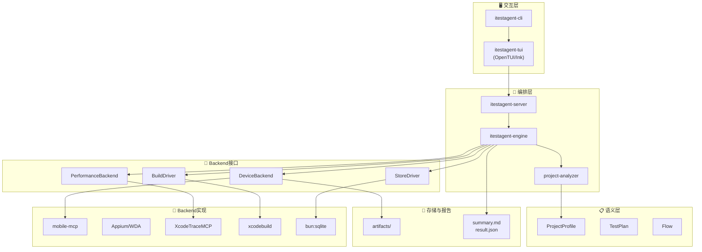
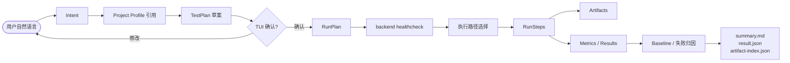
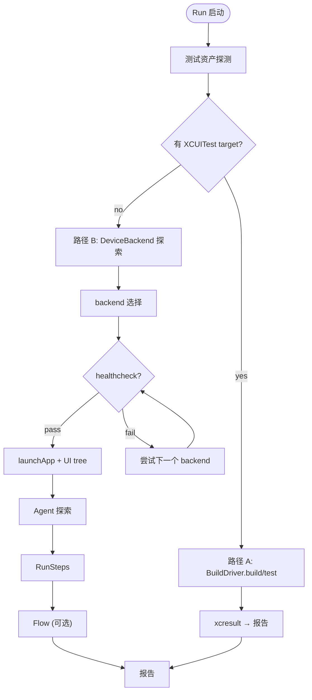
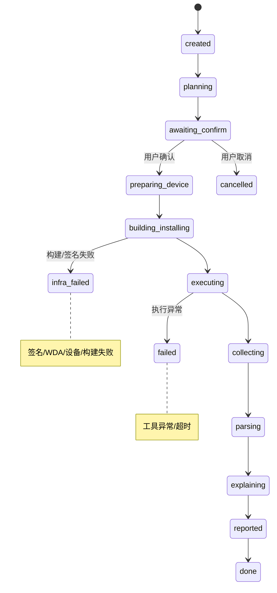

# 最终架构设计文档

更新时间：2026-07-17（ADR-011 Simulator 同级支持审计更新）

本文档由两类资料合并生成：

1. iTestAgent 原有架构设计文档中的稳定部分：产品范围、架构目标、分层职责、Agent 编排循环、数据模型、Run 状态机、错误分级、安全约束、演进路线和能力清单。
2. 钉钉“调研”文件夹下新版架构分析中的改进部分：稳定上层协议、可插拔 backend、候选 backend 横评、统一接口、统一产物模型、Phase 0 决策矩阵。

最终立场：**iTestAgent 应该是 project-aware 的测试语义与证据系统，而不是某个底层工具的壳。** 稳定的是 ProjectProfile、TestPlan、RunStep、Flow、ArtifactRef、result.json、artifact-index.json；可替换的是 mobile-mcp、Appium/WDA、iphone-use、XcodeTraceMCP、instrumentsmcp、XcodeProj、XcodeQuery、Drizzle、Kysely 等 backend。

------

## 1. 架构目标与边界

### 1.1 产品目标

```
TUI-first：交互式终端是核心界面，CLI 只作轻量入口。
Local-first：全流程本机运行，无需登录、中心化服务或云真机。
Project-aware：先理解 iOS 项目，再生成测试计划。
Real-device-first：第一版重点面向本机连接的 iPhone 真机。
Target-explicit：真机与 iOS Simulator 同级支持，执行目标始终显式（ADR-011）。
Evidence-first：每次运行都要结构化记录、证据留档、可解释、可追溯。
Backend-pluggable：底层工具可替换，上层语义和产物不随工具变化。
Safety-first：危险操作二次确认，敏感数据不落盘明文。
```

### 1.2 关键约束

```
依赖 macOS + Xcode 工具链。
依赖签名、Provisioning、Developer Mode、设备信任、WDA 或等价 backend 前置条件（Simulator 免除签名/信任/Developer Mode 要求）。
探索式执行默认不保证可复现，只有固化为 Flow 后才可复现。
性能指标以 launch / memory 近似 / crash / hitches / hangs / duration 为主。
FPS 为 FPS-like 近似，不承诺精确实时 FPS。
深度 xctrace summary 为实验性，必须保留原始 .trace。
```

### 1.3 最重要的架构原则

```
稳定的是 iTestAgent 语义层：ProjectProfile / TestPlan / RunStep / Flow / ArtifactRef / result.json / artifact-index.json。
可变的是 backend：Appium-WDA（physical+simulator）/ mobile-mcp（physical）/ iphone-use / XcodeTraceMCP / instrumentsmcp / simctl / XcodeProj / XcodeQuery / Drizzle / Kysely 等。
engine 不直接拼底层命令，只调用内部接口。
backend 只负责执行能力，不负责决定测试策略。
所有 backend 输出都要归一化为 iTestAgent 自己的数据契约。
```

## 2. 总体分层架构

```
交互层
  itestagent-cli / itestagent-tui / headless mode

编排层
  itestagent-server / itestagent-engine / AgentRuntime / PermissionEngine / RunStateMachine

语义层
  ProjectProfile / Intent / TestPlan / RunPlan / Flow / AssertionPolicy

Backend 接口层
  DeviceBackend / PerformanceBackend / BuildDriver / ProjectAnalyzerBackend / StoreDriver / ReportBackend

Backend 实现层
  Appium-WDA（physical+simulator，ADR-011）/ mobile-mcp（physical）/ iphone-use /
  XcodeTraceMCP / instrumentsmcp / simctl / XcodeProj / XcodeQuery / xcodebuild / xcbeautify / bun:sqlite / Drizzle / Kysely

存储与报告层
  SQLite metadata / filesystem artifacts / result.json / artifact-index.json / summary.md
```

### 2.1 系统架构图



## 3. 组件职责

| 组件                 | 职责                                                         | 不做                |
| -------------------- | ------------------------------------------------------------ | ------------------- |
| `itestagent-cli`     | 命令入口：启动 TUI、doctor、devices、config、run、explain、rerun | 不承载测试主流程    |
| `itestagent-tui`     | 交互式界面（默认 OpenTUI+SolidJS，ADR-008）：对话、计划确认、权限确认、进度、证据浏览 | 不直接调用底层工具  |
| `itestagent-server`  | 本地长任务、SSE 事件流、session 管理、子进程生命周期         | 不含测试策略        |
| `itestagent-engine`  | 意图理解、TestPlan 编译、Agent loop、工具调度、失败归因      | 不直接拼 shell 命令 |
| `AgentRuntime`       | 抽象 AI SDK / Mastra / LangGraph 等 agent loop backend       | 不关心具体设备工具  |
| `PermissionEngine`   | allow/ask/deny、危险操作拦截、记忆规则                       | 不绕过用户确认      |
| `RunStateMachine`    | Run 生命周期、错误等级、暂停/恢复/取消                       | 不执行工具          |
| `ProjectAnalyzer`    | 生成 Project Profile、候选链路、证据和置信度                 | 不自动断定核心链路  |
| `DeviceBackend`      | 真机与 Simulator 操作统一接口（ADR-011 双目标）              | 不决定测试目标      |
| `PerformanceBackend` | trace 录制/导出/摘要/baseline 对比                           | 不伪造不可导出指标  |
| `BuildDriver`        | 构建（physical+simulator destination union）、签名、安装前产物生成、日志格式化 | 不决定测试策略      |
| `StoreDriver`        | SQLite metadata、migrations、transaction                     | 不存大文件 blob     |
| `ArtifactStore`      | 截图/视频/日志/trace/xcresult 文件落盘与索引                 | 不把敏感内容外传    |
| `ReportBackend`      | 生成 summary.md、result.json、artifact-index.json            | 不直接执行测试      |
| `SessionManager`     | session 创建/关闭、workspace、runId、SSE subscriber、session 隔离 | 不决定测试策略      |
| `ToolRegistry/ToolDispatcher` | ToolCall→Zod parse→PermissionEngine→BackendSelector→backend method→normalize ToolResult→RunStep/Artifact→AgentEvent | 不绕过权限层        |
| `BackendSelector`    | 按 targetKind + capabilities + healthcheck 选择 backend，同类型 fallback，跨类型 ask（ADR-011） | 不直接启动子进程    |
| `ContextBuilder`     | 输入 ProjectProfile/Intent/TestPlan/Run state                  | 禁止 secret 明文和大体积原始证据进入模型上下文 |

## 4. 核心流程

### 4.1 Agent Session 流程



### 4.2 执行路径选择



### 4.3 backend 选择策略

```
execution:
  backendPreference:
    device:
      physical:     # ADR-011 per-targetKind preference
        - appium
        - mobile-mcp
        - mock
      simulator:
        - appium
        - mock
    performance:
      - xctrace-analyzer-core
      - instrumentsmcp
      - raw-xcrun-minimal
    build:
      - xcodebuild-native
      - fastlane
      - codemagic-cli-tools
    projectAnalyzer:
      - xcodequery
      - xcodeproj-helper
      - raw-xcodebuild
  allowCrossTargetFallback: false    # must ask user
  fallbackPolicy: ask_user
```

选择规则：

1. 根据 targetKind 过滤 Backend（BackendCapabilities.supportedTargetKinds）。
2. 用户显式指定 backend 时优先。
3. 未指定时按 per-targetKind 偏好顺序（ADR-011 §16.4）。
4. backend healthcheck 不通过则尝试同 targetKind 下一个。
5. 同 targetKind 内 fallback 记录到 result.json。
6. 跨 targetKind fallback 必须询问用户（allowCrossTargetFallback: false 默认）。
7. 未知 Backend → backend_not_registered；能力不足 → backend_capability_unsupported。
8. 不得静默回落到 Appium。

## 5. Backend 接口设计

### 5.1 DeviceBackend

```
interface DeviceBackend {
  readonly name: string;
  readonly capabilities: BackendCapabilities;

  listDevices(): Promise<DeviceInfo[ ]>;

  healthcheck(deviceId: string): Promise<HealthCheckResult>;

  listApps(deviceId: string): Promise<AppInfo[ ]>;

  launchApp(input: LaunchAppInput): Promise<ActionResult>;
  terminateApp(input: TerminateAppInput): Promise<ActionResult>;
  getUiTree(input: DeviceTarget): Promise<UiTreeSnapshot>;
  screenshot(input: ScreenshotInput): Promise<ArtifactRef>;
  tap(input: TapInput): Promise<ActionResult>;
  swipe(input: SwipeInput): Promise<ActionResult>;
  typeText(input: TypeTextInput): Promise<ActionResult>;
  pressButton(input: PressButtonInput): Promise<ActionResult>;
  openUrl(input: OpenUrlInput): Promise<ActionResult>;
  startRecording(input: RecordingInput): Promise<RecordingHandle>;
  stopRecording(input: RecordingHandle): Promise<ArtifactRef>;

  listCrashes(input: DeviceTarget): Promise<CrashSummary[ ]>;

  collectLogs(input: LogCollectInput): Promise<ArtifactRef>;
}
```

BuildDriver destination union（ADR-011）：
- physical: `platform=iOS,id=<UDID>` → devicectl 安装/启动
- simulator: `platform=iOS Simulator,id=<UDID>` → simctl 安装/启动

实现候选：

- `AppiumBackend`：**MVP 主 backend，同时支持 physical + simulator（ADR-011）**。T0.2 横评验证真机 session + page source + screenshot 全通过。G5 真机验证 7/7 PASS（Task 3.7, iPhone 14 Plus iOS 18.2.1）。**ADR-012**：使用 `WdaManager` 自管 WDA 生命周期（build/install/launch via devicectl + xcodebuild `-project -scheme` + `test-without-building`），Appium 仅处理 WebDriver session（`usePrebuiltWDA: true`, `useNewWDA: false`），绕过 Appium 的 xcodebuild pipeline 和免费账号签名限制。Physical adapter: devicectl/xcodebuild + Appium/WDA + WdaManager。Simulator adapter: simctl/xcodebuild + Appium/WDA。
- `MobileMcpBackend`：强候选（MCP-native + WebView/FS/Crash/Remote 独特能力），但需付费开发者账号（免费账号 mobilecli 硬编码 agent bundle ID 无法绕过）。
- `IphoneUseBackend`：WDA tree 差时的视觉/镜像 fallback。Phase 6+。
- `CloudDeviceBackend`：Phase 6+ 云真机。
- `MockBackend`：无真机开发和 CI 必备（T0.2 fixture + TDD 验证通过）。支持 physical + simulator fixtures。

> **Appium/WDA 免费账号 workaround（T0.2b 验证）**：WDA 默认 bundle ID `com.facebook.WebDriverAgentRunner.xctrunner` 已被 Facebook 注册，免费账号无法使用。Workaround：手动 `xcodebuild` 加 `-allowProvisioningUpdates` + 改 `PRODUCT_BUNDLE_IDENTIFIER` 为 `TEAMID.WebDriverAgentRunner.xctrunner`，Xcode 自动注册 app ID + 生成 profile。Appium 用 `usePrebuiltWDA: true` + `updatedWDABundleId` 跳过自动编译。免费账号 profile 7 天过期需定期重建。

### 5.2 PerformanceBackend

```
interface PerformanceBackend {
  recordTrace(input: TraceRecordInput): Promise<ArtifactRef>;
  exportTrace(input: TraceExportInput): Promise<TraceExportStatus>;
  summarizeTrace(input: TraceSummaryInput): Promise<TraceSummary>;
  symbolicate(input: SymbolicateInput): Promise<ArtifactRef>;
  compareBaseline(input: BaselineCompareInput): Promise<BaselineDelta>;
}
```

实现候选：

- `xctrace-analyzer-core`：MVP 默认（T0.3 横评验证：supportStatus/not_exportable 语义符合 R5）。
- `自研 hitches-* schema parser`：iTestAgent 内部模块，解析 hitches-summary + hitches-*-interval（T0.3 全网搜索未找到直接替代公开实现）。
- `instrumentsmcp`：录制/report 工作流参考。**不作为默认可信 backend**（T0.3 横评发现 Network/Hitches 漏报、Allocations 误导，违反 R5）。
- `raw-xcrun-minimal`：fallback（T0.3 验证能导出 23 schema + hitches-summary 49 行）。
- `instruments-analyzer-duckdb`：Phase 6+ 深度分析。
- `memorydetective-enhanced`：Phase 6+ memory/hang/MetricKit 增强。

### 5.3 BuildDriver

```
interface BuildDriver {
  doctor(): Promise<BuildDoctorResult>;

  listSchemes(root: string): Promise<SchemeInfo[ ]>;

  showBuildSettings(input: BuildSettingsInput): Promise<BuildSettings>;
  build(input: BuildInput): Promise<BuildResult>;
  test(input: TestInput): Promise<TestResult>;
  archive(input: ArchiveInput): Promise<ArchiveResult>;
}
```

实现候选：

- `xcodebuild-native`：MVP 默认。
- `fastlane`：项目已有 Fastfile 或签名复杂时启用。
- `codemagic-cli-tools`：可选 driver 和 workflow 参考。
- `xcodegen/tuist`：用于生成项目或支持项目自身使用这些工具。

### 5.4 ProjectAnalyzerBackend

```
interface ProjectAnalyzerBackend {
  discover(root: string): Promise<ProjectDiscovery>;
  graph(input: ProjectDiscovery): Promise<ProjectGraph>;
  buildSettings(input: BuildSettingsQuery): Promise<ResolvedBuildSettings>;
  scanSources(input: SourceScanInput): Promise<SourceFacts>;
  scanResources(input: ResourceScanInput): Promise<ResourceFacts>;
}
```

实现候选：

- `raw-xcodebuild`：Apple 官方事实源（T0.5 验证 -list/-showBuildSettings -json 可用）。
- `xcodequery`：~~MVP JSON backend 强候选~~ → T0.5 本机不可用，降级为 optional future spike。
- `xcodeproj-helper`：成熟项目图解析（T0.5 验证 Tuist/XcodeProj SwiftPM resolve/build/run 通过）。→ **已实现**：`packages/itestagent-backends/analyzer-xcodeproj`（自研轻量 pbxproj 解析器 + xcodebuild CLI 封装，零外部依赖，Task 2.1 / US-3.1 AC1）。
- `swiftsyntax-helper`：Swift 结构解析（Task 2.2）。
- `sourcekit/indexstore`：可选语义增强（Task 2.2）。

### 5.5 Store / Secret / Artifact

```
interface StoreDriver {
  migrate(): Promise<void>;
  transaction<T>(fn: () => Promise<T>): Promise<T>;
}

interface SecretStore {
  get(key: string): Promise<string | null>;
  set(key: string, value: string): Promise<void>;
  delete(key: string): Promise<void>;
}

interface ArtifactStore {
  put(input: ArtifactInput): Promise<ArtifactRef>;
  get(id: string): Promise<ArtifactRef | null>;

  search(query: string): Promise<ArtifactRef[ ]>;

}
```

MVP 候选：bun:sqlite + Drizzle + Zod + JSONC + macOS security CLI + filesystem artifacts + SQLite FTS5。

### 5.6 AgentRuntime

```
interface AgentRuntime {
  streamTurn(input: AgentTurnInput): AsyncIterable<AgentEvent>;
  executeToolCall(call: ToolCall): Promise<ToolResult>;
  abort(reason: string): Promise<void>;
}
```

MVP 候选：Vercel AI SDK。横评候选：Mastra、LangGraph、OpenAI Agents SDK。

## 6. 数据模型

### 6.1 ProjectProfile

```
interface ProjectProfile {
  schemaVersion: string;
  projectHash: string;
  app: {
    name?: string;
    bundleId?: string;
    workspace?: string;
    project?: string;
    scheme?: string;
  };

  targets: TargetProfile[ ];

  testAssets: TestAssetsProfile;

  features: FeatureCandidate[ ];


  suggestedSmoke: string[ ];

}
```

确定性字段来自 xcodebuild / XcodeProj / XcodeQuery。推断字段必须包含 evidence + confidence，并在 TUI 中由用户确认。

### 6.2 TestPlan

```
interface TestPlan {
  schemaVersion: string;
  runId: string;
  projectProfileRef: string;
  deviceSelector: DeviceSelector;  // kind: physical|simulator (ADR-011)
  backendPreference: BackendPreference;
  execution: ExecutionPlan;
  artifacts: ArtifactPolicy;
  performance: PerformancePlan;
  safety: PermissionPolicyRef;
}
```

### 6.3 RunStep

```
interface RunStep {
  stepId: string;
  backend: string;
  action: string;
  target?: string;
  input: unknown;
  result: DeviceActionResult | BuildResult | TraceSummary;

  artifacts: ArtifactRef[ ];

  safetyGate?: 'allow' | 'ask' | 'deny';
  startedAt: string;
  durationMs: number;
}
```

### 6.4 ArtifactRef

```
interface ArtifactRef {
  id: string;
  type: 'screenshot' | 'video' | 'uitree' | 'log' | 'crashlog' | 'trace' | 'xcresult' | 'json' | 'text';
  path: string;
  mimeType?: string;
  sizeBytes?: number;
  sha256?: string;
  relatedStep?: string;
  backend?: string;
  redactionStatus: 'raw-local-only' | 'redacted' | 'safe';
}
```

### 6.5 result.json

```
interface RunResult {
  schemaVersion: string;
  runId: string;
  status: 'passed' | 'failed' | 'explored' | 'inconclusive' | 'needs_assertion' | 'flaky' | 'blocked';
  projectProfileRef: string;
  device: DeviceSnapshot;                 // 含 targetKind（ADR-011）
  execution: ExecutionSummary;           // 含 targetKind, mode, backendUsed
  environment: {                          // ADR-011 simulator report metadata
    targetKind: 'physical' | 'simulator';
    representativeOfPhysicalDevice: boolean;
    comparisonScope: 'simulator_only' | 'physical_only';
    hostFingerprint?: string;            // Simulator required
    xcodeVersion?: string;               // Simulator required
  };

  cases: TestCaseResult[ ];

  metrics: PerformanceMetrics;
  baselineDelta?: BaselineDelta;         // 跨 targetKind 比较被 Store 层拒绝

  artifactRefs: string[ ];

  explanation?: FailureExplanation;
}
```

### 6.6 artifact-index.json

借鉴 Maestro ArtifactManifest：

```
interface ArtifactIndex {
  schemaVersion: string;
  runId: string;

  artifacts: ArtifactRef[ ];

}
```

### 6.7 Flow YAML

借鉴 Maestro DSL，但保持 iTestAgent 自有 schema：

```
schemaVersion: itestagent.flow.v2
flowId: login-smoke
source: agent-recorded
status: draft
supportedTargetKinds: [physical, simulator]   # ADR-011
requiredCapabilities: [uiTree, coordinateTap]  # normalized, not Appium-specific
lastValidatedTargets:                          # audit trail
  - kind: simulator
    deviceTypeIdentifier: com.apple.CoreSimulator.SimDeviceType.iPhone-15-Pro
    runtimeIdentifier: com.apple.CoreSimulator.SimRuntime.iOS-18-2
steps:
  - action: launchApp
    target: com.example.app
  - action: tap
    target: 登录
  - action: typeText
    target: 邮箱输入框
    valueRef: session.secret.email
```

## 7. Run 状态机与错误分类

### 7.1 Run 状态机



### 7.2 错误分类

```
blocked.security       企业安全/EDR 阻断
blocked.setup          工具未安装、签名未配置、WDA 未就绪
blocked.no_real_device 未发现实体 iPhone（physical only）
blocked.unsupported_target  要求的 targetKind 不被任何已注册 Backend 支持（ADR-011）
blocked.privacy        当前屏幕含隐私，不允许截图/操作
blocked.safety         操作高风险，需要用户确认或禁止
capability.missing     backend 不支持所需能力
backend.error          backend 内部错误
artifact.error         证据落盘失败
app_state.unexpected   App 状态不符合预期
timeout.flaky          超时或疑似 flaky
not_exportable         工具或 Xcode 不可导出某类数据
inconclusive           证据不足
```

### 7.3 L1-L4 分级

| 等级      | 定义                                         | 处理策略                             |
| --------- | -------------------------------------------- | ------------------------------------ |
| L1 瞬态   | 元素超时、临时连接断开、文件锁               | 自动重试 3 次，指数退避              |
| L2 需确认 | 签名过期、设备断连、WDA 端口冲突             | TUI 暂停，用户修复后继续             |
| L3 阻断   | Xcode 缺失、Developer Mode 未开（physical）、无可用的 Simulator runtime（simulator）、无匹配 backend | 中止 run，输出 doctor 建议           |
| L4 不确定 | UI tree 残缺、xctrace not_exportable、无断言 | 标记 inconclusive / explored，不编造 |

### 7.4 Harness Event Model（ADR-010）

事件序列：

```
session.started → turn.started → assistant.delta → tool.requested
→ permission.requested → permission.resolved → tool.started → tool.progress
→ tool.completed/tool.failed → run.state.changed → artifact.created
→ turn.completed → session.idle/session.aborted
```

要求：有序、可追踪、terminal event 唯一、SSE 可重连、不同 session 隔离。

### 7.5 Abort、超时与子进程（ADR-010）

取消链：

```
TUI cancel → server command → AgentRuntime.abort → ToolDispatcher cancel
→ backend AbortSignal → child SIGTERM → grace timeout → SIGKILL if needed
→ release WDA ports/tunnels/files（physical）/ 删除 Appium session（simulator）→ RunStateMachine cancelled/failed
→ preserve partial evidence index
```

不变量：abort 幂等；session 结束后无 pending tool；无 orphan child process；已生成 evidence 仍可索引；ask 可取消且有 timeout；同 UDID 串行、不同 UDID 并行（physical 和 simulator 可同时执行）。每个并行 Simulator session 需要独立 wdaLocalPort、mjpegServerPort、derivedDataPath 和 artifact 目录。

## 8. 权限与安全

高风险操作默认 ask：

```
清 App 数据
卸载/重装 App
写项目目录
保存账号/token
接受新 baseline
覆盖 Flow
生成测试代码草稿
打开非 http/https URL scheme
读取或导出可能含隐私的截图/视频/日志
Simulator erase/delete
Simulator reset keychain/privacy（ADR-011）
```

敏感数据策略：

```
真实账号/OTP/token 只在内存使用。
用户选择记住时写入 macOS Keychain。
JSONC / result.json / summary.md / logs 不写明文 secret。
截图/视频只本地保存，外传前必须脱敏或用户确认。
```

## 9. Phase 0 横评与决策矩阵

### 9.1 必做横评

```
真机 backend：mobile-mcp / Appium / iphone-use / mock
性能 backend：XcodeTraceMCP core / instrumentsmcp / raw xcrun / instruments-analyzer
TUI backend：OpenTUI / Ink / headless（Rezi 已排除：npm rezi 非 TUI 框架）
Project analyzer：XcodeQuery / XcodeProj / raw xcodebuild / SwiftSyntax
Store：Drizzle / Kysely / raw bun:sqlite
Agent runtime：AI SDK / Mastra / LangGraph
```

### 9.2 决策矩阵

| 如果                                | 则                                          |
| ----------------------------------- | ------------------------------------------- |
| mobile-mcp 真机稳定且付费账号可用   | 可补测后作为 mobile-mcp backend              |
| mobile-mcp 被云壳/免费账号限制阻断  | AppiumBackend 做主线（T0.2b 已验证免费账号可用） |
| WDA UI tree 质量差                  | 研究 iphone-use 视觉 fallback               |
| XcodeTraceMCP core 稳定             | 性能模块优先复用 core                       |
| XcodeTraceMCP core 不适合依赖       | raw-xcrun-minimal fallback                  |
| OpenTUI 不稳定                      | Ink fallback（T0.4 已验证 16/16 通过）      |
| XcodeQuery 不可用                   | raw xcodebuild + Tuist/XcodeProj 优先       |
| Drizzle 迁移/打包不合适             | Kysely + raw migration fallback             |
| 需要强 workflow resume              | 横评 Mastra/LangGraph                       |

```
## 10. 推荐目录结构

```text
packages/
  itestagent-cli/
  itestagent-tui/
  itestagent-engine/
  itestagent-server/
  itestagent-store/
  itestagent-project-analyzer/
  itestagent-contracts/
  itestagent-backends/
    device-mobile-mcp/
    device-appium/
    device-iphone-use/
    performance-xctrace-analyzer/
    performance-instrumentsmcp/
    build-xcodebuild/
    build-fastlane/
    analyzer-xcodequery/
    analyzer-xcodeproj/
  itestagent-report/
  itestagent-flow/

schemas/
  project-profile.schema.json
  test-plan.schema.json
  result.schema.json
  artifact-index.schema.json
  flow.schema.json

fixtures/
  device-responses/
  mobile-mcp/
  appium/
  simulator/          # ADR-011 Simulator-specific fixtures
  xctrace/
  xcresult/
```

## 11. MVP 推荐取舍

MVP 不要一次性实现所有 backend（ADR-011 双目标同级支持已纳入 MVP）。推荐顺序：

1. MockBackend：保障无真机开发与 CI（physical + simulator fixtures）。
2. AppiumBackend：MVP 主 backend（T0.2b 验证免费账号可用）。
3. mobile-mcp backend：强候选，待付费开发者账号补测。
4. xctrace-analyzer-core performance backend。
5. raw xcodebuild + xcbeautify build driver。
6. bun:sqlite + Drizzle store。
7. OpenTUI + Commander shell。

Phase 6+ 再考虑：iphone-use fallback、cloud backend、instruments-analyzer DuckDB、memorydetective、Allure dashboard、Mastra/LangGraph durable workflows。

## 12. 总结

最终架构应同时吸收两份文档的优点：

- 原有架构文档的优点：产品范围清楚、分层职责清楚、Run 状态机完整、错误分级和安全约束扎实、流程可审计。
- 新版调研文档的优点：不被单一工具锁死、backend 可插拔、Phase 0 横评、统一接口和产物模型。

最终目标：**iTestAgent 是一个 project-aware、target-explicit 的测试语义与证据系统。底层工具可以替换、上层契约必须稳定、真机与 Simulator 同级可验证。**