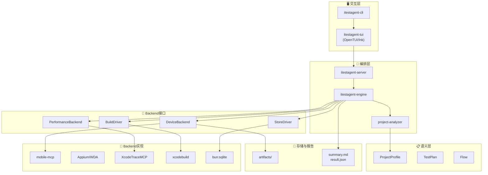
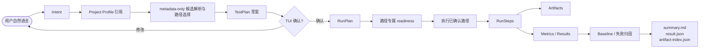
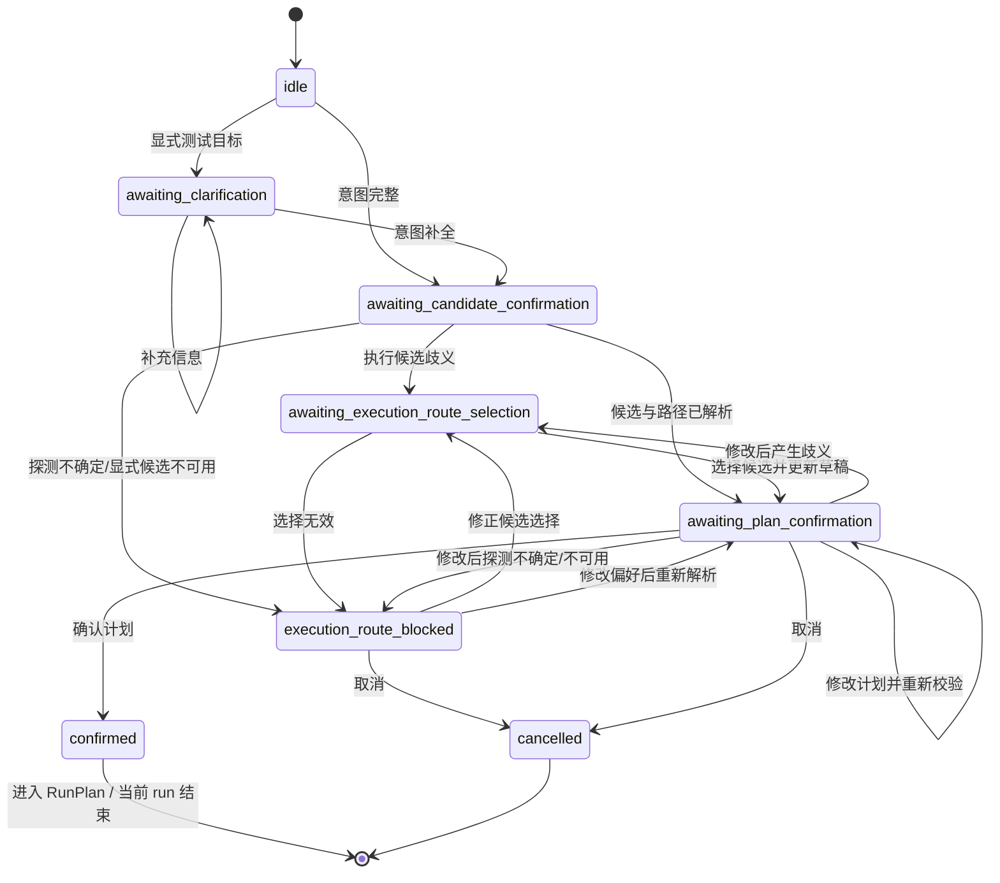
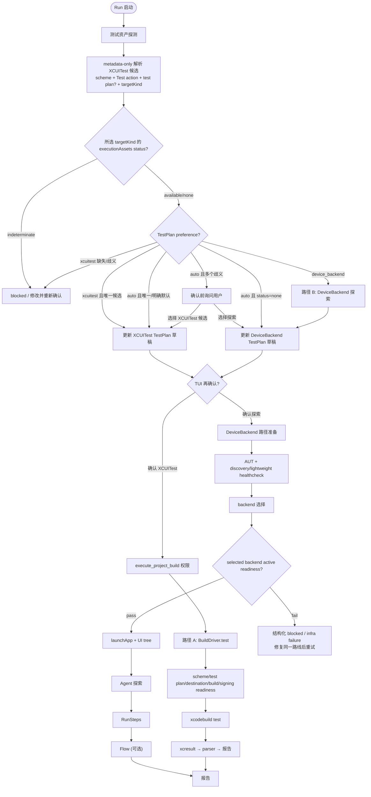
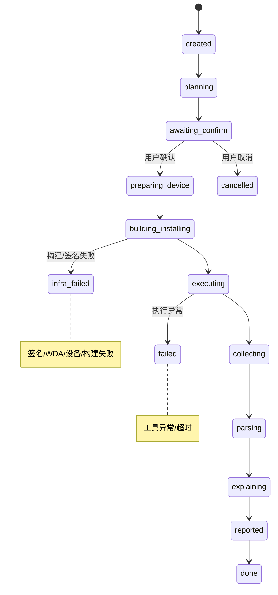

# 最终架构设计文档

更新时间：2026-09-02（ADR-034 run bundle 与计划快照语义同步）

本文档由两类资料合并生成：

1. iTestAgent 原有架构设计文档中的稳定部分：产品范围、架构目标、分层职责、Agent 编排循环、数据模型、Run 状态机、错误分级、安全约束、演进路线和能力清单。
2. 钉钉“调研”文件夹下新版架构分析中的改进部分：稳定上层协议、可插拔 backend、候选 backend 横评、统一接口、统一产物模型、Phase 0 决策矩阵。

最终立场：**iTestAgent 应该是 project-aware 的测试语义与证据系统，而不是某个底层工具的壳。** 稳定的是 ProjectProfile、TestPlan、RunStep、Flow、ArtifactRef、result.json、artifact-index.json；可替换的是 mobile-mcp、Appium/WDA、iphone-use、XcodeTraceMCP、instrumentsmcp、XcodeProj、XcodeQuery、Drizzle、Kysely 等 backend。

------

## 1. 架构目标与边界

### 1.1 产品目标

```
TUI-first：交互式终端是核心界面，CLI 只作轻量入口。
Local-first：全流程本机运行，无需登录、中心化服务或云真机。
Project-aware：先理解 iOS 项目，再生成测试计划。
Real-device-first：第一版重点面向本机连接的 iPhone 真机。
Target-explicit：真机与 iOS Simulator 同级支持，执行目标始终显式（ADR-011）。
Evidence-first：每次运行都要结构化记录、证据留档、可解释、可追溯。
Backend-pluggable：底层工具可替换，上层语义和产物不随工具变化。
Safety-first：危险操作二次确认，敏感数据不落盘明文。
```

### 1.2 关键约束

```
依赖 macOS + Xcode 工具链。
依赖签名、Provisioning、Developer Mode、设备信任、WDA 或等价 backend 前置条件（Simulator 免除签名/信任/Developer Mode 要求）。
探索式执行默认不保证可复现，只有固化为 Flow 后才可复现。
性能指标以 launch / memory 近似 / crash / hitches / hangs / duration 为主。
FPS 为 FPS-like 近似，不承诺精确实时 FPS。
深度 xctrace summary 为实验性，必须保留原始 .trace。
```

### 1.3 最重要的架构原则

```
稳定的是 iTestAgent 语义层：ProjectProfile / TestPlan / RunStep / Flow / ArtifactRef / result.json / artifact-index.json。
可变的是 backend：Appium-WDA（physical+simulator）/ mobile-mcp（physical）/ iphone-use / XcodeTraceMCP / instrumentsmcp / simctl / XcodeProj / XcodeQuery / Drizzle / Kysely 等。
engine 不直接拼底层命令，只调用内部接口。
backend 只负责执行能力，不负责决定测试策略。
所有 backend 输出都要归一化为 iTestAgent 自己的数据契约。
```

## 2. 总体分层架构

```
交互层
  itestagent-cli / itestagent-tui / headless mode

编排层
  itestagent-server / itestagent-engine / AgentRuntime / PermissionEngine / RunStateMachine

语义层
  ProjectProfile / Intent / TestPlan / RunPlan / Flow / AssertionPolicy

Backend 接口层
  DeviceDiscoveryProvider / DeviceBackend / PerformanceBackend / BuildDriver / ProjectAnalyzerBackend / StoreDriver / ReportBackend

Backend 实现层
  Appium-WDA（physical+simulator，ADR-011）/ mobile-mcp（physical）/ iphone-use /
  XcodeTraceMCP / instrumentsmcp / simctl / XcodeProj / XcodeQuery / xcodebuild / xcbeautify / bun:sqlite / Drizzle / Kysely

存储与报告层
  SQLite metadata / filesystem artifacts / result.json / artifact-index.json / summary.md
```

### 2.1 系统架构图


```mermaid
graph TB
    subgraph 交互层["🖥️ 交互层"]
        CLI["itestagent-cli"]
        TUI["itestagent-tui<br/>(OpenTUI/Ink)"]
    end
    subgraph 编排层["🧠 编排层"]
        Server["itestagent-server"]
        Engine["itestagent-engine"]
        Analyzer["project-analyzer"]
    end
    subgraph 语义层["📋 语义层"]
        Profile["ProjectProfile"]
        TestPlan["TestPlan"]
        Flow["Flow"]
    end
    subgraph Backend接口["🔌 Backend接口"]
        DevBackend["DeviceBackend"]
        PerfBackend["PerformanceBackend"]
        BuildBackend["BuildDriver"]
        StoreBackend["StoreDriver"]
    end
    subgraph Backend实现["🔧 Backend实现"]
        MobileMCP["mobile-mcp"]
        Appium["Appium/WDA"]
        XcodeTrace["XcodeTraceMCP"]
        XcodeBuild["xcodebuild"]
        SQLite["bun:sqlite"]
    end
    subgraph 存储层["💾 存储与报告"]
        Artifacts["artifacts/"]
        Reports["summary.md<br/>result.json"]
    end
    CLI --> TUI --> Server --> Engine
    Engine --> Analyzer --> Profile
    Engine --> DevBackend --> MobileMCP
    Engine --> PerfBackend --> XcodeTrace
    Engine --> BuildBackend --> XcodeBuild
    Engine --> StoreBackend --> SQLite
    Engine --> Reports
    DevBackend --> Artifacts
```

## 3. 组件职责

| 组件                 | 职责                                                         | 不做                |
| -------------------- | ------------------------------------------------------------ | ------------------- |
| `itestagent-cli`     | 命令入口：启动 TUI、doctor、devices、config、run、explain、rerun | 不承载测试主流程    |
| `itestagent-tui`     | 交互式界面（OpenTUI+SolidJS 为目标主线；当前生产入口暂用 ANSI，切换由 T6.10/DEF-025 跟踪，ADR-008）：对话、计划确认、权限确认、进度、证据浏览；消费生产会话 facade/事件 | 不直接执行 backend 操作或管理底层子进程  |
| `itestagent-server`  | 本地长任务、SSE 事件流、session 管理；拥有自身启动的子进程   | 不含测试策略、不接管其他 owner 的子进程 |
| `itestagent-engine`  | 意图理解、TestPlan 编译、Agent loop、Flow 生产重放编排、工具调度、失败归因；可依赖语义层 `itestagent-flow`，负责注入生产 backend、目标与 readiness，不在 Flow 包内装配具体 backend | 不直接拼 shell 命令 |
| `AgentRuntime`       | 抽象 AI SDK / Mastra / LangGraph 等 agent loop backend       | 不关心具体设备工具  |
| `PermissionEngine`   | allow/ask/deny、危险操作拦截、记忆规则                       | 不绕过用户确认      |
| `RunStateMachine`    | Run 生命周期、错误等级、暂停/恢复/取消                       | 不执行工具          |
| `ProjectAnalyzer`    | 生成 Project Profile、候选链路、证据和置信度                 | 不自动断定核心链路  |
| `DeviceDiscoveryProvider` | 在选择目标前返回 physical/simulator 清单、聚合状态与分通道 limitation | 不执行绑定 UDID 的设备操作 |
| `DeviceBackend`      | 真机与 Simulator 操作统一接口（ADR-011 双目标）              | 不决定测试目标      |
| `PerformanceBackend` | trace 录制/导出/摘要/baseline 对比                           | 不伪造不可导出指标  |
| `BuildDriver`        | 构建（physical+simulator destination union）、签名、安装前产物生成、日志格式化 | 不决定测试策略      |
| `StoreDriver`        | SQLite metadata、migrations、transaction                     | 不存大文件 blob     |
| `ArtifactStore`      | 截图/视频/日志/trace/xcresult 文件落盘与索引                 | 不把敏感内容外传    |
| `ReportBackend`      | 生成 summary.md、result.json、artifact-index.json            | 不直接执行测试      |
| `SessionManager`     | session 创建/关闭、workspace、runId、SSE subscriber、session 隔离 | 不决定测试策略      |
| `ToolRegistry/ToolDispatcher` | ToolCall→Zod parse→PermissionEngine→BackendSelector→backend method→normalize ToolResult→RunStep/Artifact→AgentEvent | 不绕过权限层        |
| `BackendSelector`    | 按 targetKind + capabilities + healthcheck 选择 backend，同类型 fallback，跨类型 ask（ADR-011） | 不直接启动子进程    |
| `ContextBuilder`     | 输入 ProjectProfile/Intent/TestPlan/Run state                  | 禁止 secret 明文和大体积原始证据进入模型上下文 |

TUI 边界说明：依赖装配本身不等于底层工具调用。TUI 可以请求 Engine 提供的生产会话组合/facade，并通过会话事件消费项目分析、设备发现和工具结果；TUI 不得直接调用 `DeviceBackend`、`ProjectAnalyzerBackend`、`DeviceDiscoveryProvider` 或底层命令。选定目标前的清单发现通过 `DeviceDiscoveryProvider`；选定目标后的运行期操作经过 `ToolDispatcher → PermissionEngine → BackendSelector → backend`。Provider/Backend 各自拥有所启动的子进程，Server 管理 session 和事件流（ADR-023）。

设备发现结果必须携带聚合状态：`ok`（所有发现通道成功）、`partial`（至少一个通道成功且至少一个失败）、`failed`（所有通道失败），并保留分通道 limitation。设备进入清单只代表 `discovered`；physical 设备通过配对/连接过滤后视为 ready，Simulator 仅 `booted` 为 ready。TUI 不得用 `devices.length > 0` 直接推断 healthy。

## 4. 核心流程

### 4.1 Agent Session 流程


```mermaid
flowchart LR
    NL(["用户自然语言"]) --> Intent["Intent"]
    Intent --> Profile["Project Profile 引用"]
    Profile --> Resolve["metadata-only 候选解析与路径选择"]
    Resolve --> Plan["TestPlan 草案"]
    Plan --> Confirm{"TUI 确认?"}
    Confirm -->|确认| RunPlan["RunPlan"]
    Confirm -->|修改| NL
    RunPlan --> Health["路径专属 readiness"]
    Health --> Execute["执行已确认路径"]
    Execute --> RunSteps["RunSteps"]
    RunSteps --> Artifacts["Artifacts"]
    RunSteps --> Metrics["Metrics / Results"]
    Metrics --> Baseline["Baseline / 失败归因"]
    Baseline --> Report["summary.md<br/>result.json<br/>artifact-index.json"]
```

#### 4.1.1 Planning Cycle 状态边界


```mermaid
stateDiagram-v2
    [*] --> idle
    idle --> awaiting_clarification: 显式测试目标
    idle --> awaiting_candidate_confirmation: 意图完整
    awaiting_clarification --> awaiting_clarification: 补充信息
    awaiting_clarification --> awaiting_candidate_confirmation: 意图补全
    awaiting_candidate_confirmation --> awaiting_execution_route_selection: 执行候选歧义
    awaiting_candidate_confirmation --> execution_route_blocked: 探测不确定/显式候选不可用
    awaiting_candidate_confirmation --> awaiting_plan_confirmation: 候选与路径已解析
    awaiting_execution_route_selection --> awaiting_plan_confirmation: 选择候选并更新草稿
    awaiting_execution_route_selection --> execution_route_blocked: 选择无效
    execution_route_blocked --> awaiting_execution_route_selection: 修正候选选择
    execution_route_blocked --> awaiting_plan_confirmation: 修改偏好后重新解析
    execution_route_blocked --> cancelled: 取消
    awaiting_plan_confirmation --> awaiting_plan_confirmation: 修改计划并重新校验
    awaiting_plan_confirmation --> awaiting_execution_route_selection: 修改后产生歧义
    awaiting_plan_confirmation --> execution_route_blocked: 修改后探测不确定/不可用
    awaiting_plan_confirmation --> confirmed: 确认计划
    awaiting_plan_confirmation --> cancelled: 取消
    confirmed --> [*]: 进入 RunPlan / 当前 run 结束
    cancelled --> [*]
```

同一测试目标的普通多轮消息只补充当前 Planning Cycle，不得隐式重新进入规划起点或使 `confirmed` 状态失效。第一版 TUI 使用 `/plan <test goal>` 显式创建新 Planning Cycle，并原子清理旧 Intent、候选与草稿引用。`confirmed` 或 `cancelled` 后，TUI 必须提示该命令；`cancelled` 不允许通过候选确认或计划修改原地恢复。

Planning Cycle 的输入在接收时复制，向 TUI、tool 与其他调用方返回不可变快照。调用方对 candidate evidence、Intent 或 TestPlan 返回值的修改不得改变内部状态；只有内部状态机完成的确认转换可以建立或替换执行基线。

### 4.2 执行路径选择


```mermaid
flowchart TD
    Start(["Run 启动"]) --> Detect["测试资产探测"]
    Detect --> Resolve["metadata-only 解析 XCUITest 候选<br/>scheme + Test action + test plan? + targetKind"]
    Resolve --> Discovery{"所选 targetKind 的 executionAssets status?"}
    Discovery -->|indeterminate| Blocked["blocked / 修正后重新确认"]
    Discovery -->|available/none| Preference{"TestPlan preference?"}
    Preference -->|device_backend| PathB["路径 B: DeviceBackend 探索"]
    Preference -->|xcuitest 且唯一候选| DraftA["更新 XCUITest TestPlan 草稿"]
    Preference -->|xcuitest 缺失/歧义| Blocked["blocked / 修改并重新确认"]
    Preference -->|auto 且唯一/明确默认| DraftA
    Preference -->|auto 且多个歧义| Ask["确认前询问用户"]
    Ask -->|选择 XCUITest 候选| DraftA
    Ask -->|选择探索| DraftB["更新 DeviceBackend TestPlan 草稿"]
    Preference -->|auto 且 status=none| DraftB
    PathB --> DraftB
    DraftA --> Confirm{"TUI 再确认?"}
    DraftB --> Confirm
    Confirm -->|确认 XCUITest| BuildPermission["execute_project_build 权限"]
    Confirm -->|确认探索| PathBReady["DeviceBackend 路径准备"]
    BuildPermission --> PathA["路径 A: BuildDriver.test"]
    PathA --> TestReady["scheme/test plan/destination/build/signing readiness"]
    PathBReady --> DeviceReady["AUT + discovery/lightweight healthcheck"]
    TestReady --> XcodeTest["xcodebuild test"]
    DeviceReady --> SelectBackend["backend 选择"]
    XcodeTest --> XCResult["xcresult → parser → 报告"]
    SelectBackend --> Health{"selected backend active readiness?"}
    Health -->|pass| Launch["launchApp + UI tree"]
    Health -->|fail| Block["结构化 blocked / infra failure<br/>修复同一路线后重试"]
    Launch --> Explore["Agent 探索"]
    Explore --> Steps["RunSteps"]
    Steps --> Flow["Flow (可选)"]
    Flow --> Report["报告"]
    XCResult --> Report
```

确认前的 XCUITest 结构候选必须由 metadata-only evidence 证明：scheme 的 Test action 引用至少一个 graph-proven XCUITest target，可选 test plan 与 scheme 关联，且声明的 `targetKind` 相容。它不证明具体 build/signing/install/test 已成功。`ProjectProfile.testAssets.hasXCUITest` 仅表示发现 UI test target，scheme 名称包含 `test` 也不是候选充分证据，二者都不能单独触发生产路径。

规划期只允许读取 pbxproj、shared scheme/Test action 与 test plan 等元数据，不得执行 Xcode build/test/archive action、scheme pre-action 或项目 Run Script。探测必须按 `targetKind` 分别输出 `available | none | indeterminate`；只有所选目标的权威 `none` 才允许 auto 选择 DeviceBackend，所选目标的 `indeterminate` 必须 blocked。确认后执行工程 build/test action先经过 `execute_project_build`，具体 destination 上安装或替换 App/test runner 再经过 `replace_device_app`；真机此时方可传 `-allowProvisioningUpdates`（ADR-030）。

路径必须在 TestPlan 确认前解析并展示。确认后的 TestPlan 固化所选路径、scheme/test plan 与选择原因；S4 只重新验证事实。若配置消失或不再相容，RunPlan 必须 blocked 并要求修改/重新确认，不得静默换路。

`execution.fallback=device_backend` 只适用于 `prefer=auto` 在规划阶段收到所选 `targetKind` 的权威 `executionAssets.statusByTargetKind[targetKind]=none` 的情况。所选目标的 `indeterminate` 必须 blocked。`xcodebuild test` 开始后的构建、测试、超时或解析失败都保留为 XCUITest 路径结果；跨路径重试必须重新确认 TestPlan（ADR-029/030）。

### 4.3 backend 选择策略

本节只在已确认路径为 DeviceBackend 时适用。XCUITest 路径通过 BuildDriver/xcresult parser 执行，不要求 DeviceBackend 或 Appium/WDA healthcheck。共同 target readiness 完成后，两个路径分别执行自己的 readiness（ADR-029）。

```
execution:
  backendPreference:
    device:
      physical:     # ADR-011 per-targetKind preference
        - appium
        - mobile-mcp
        - mock
      simulator:
        - appium
        - mock
    performance:
      - xctrace-analyzer-core
      - instrumentsmcp
      - raw-xcrun-minimal
    build:
      - xcodebuild-native
      - fastlane
      - codemagic-cli-tools
    projectAnalyzer:
      - xcodequery
      - xcodeproj-helper
      - raw-xcodebuild
  allowCrossTargetFallback: false    # must ask user
  fallbackPolicy: ask_user
```

选择规则：

1. 根据 targetKind 过滤 Backend（BackendCapabilities.supportedTargetKinds）。
2. 用户显式指定 backend 时优先。
3. 未指定时按 per-targetKind 偏好顺序（ADR-011 §16.4）。
4. backend healthcheck 不通过则尝试同 targetKind 下一个。
5. 同 targetKind 内 fallback 记录到 result.json。
6. 跨 targetKind fallback 必须询问用户（allowCrossTargetFallback: false 默认）。
7. 未知 Backend → backend_not_registered；能力不足 → backend_capability_unsupported。
8. 不得静默回落到 Appium。

## 5. Backend 接口设计

### 5.0 DeviceDiscoveryProvider

`DeviceDiscoveryProvider.discover(options?: DeviceDiscoveryOptions)` 返回 `DeviceDiscoverySnapshot`：`devices + status(ok|partial|failed) + issues[]`，其中 `DeviceDiscoveryOptions = { signal?: AbortSignal; lanes?: readonly ('physical' | 'simulator')[] }`；`lanes` 省略或为空时发现两个通道。`status = ok` 时 `issues` 必须为空，`partial/failed` 时必须至少包含一条 issue。该接口用于目标选择之前，因此不要求预先绑定 UDID，也不经过 BackendSelector；Provider 必须拥有并回收自己启动的短生命周期发现进程。目标确定后，所有设备操作转入 DeviceBackend。

### 5.1 DeviceBackend

```
interface DeviceBackend {
  readonly name: string;
  readonly capabilities: BackendCapabilities;

  listDevices(): Promise<DeviceInfo[ ]>;

  healthcheck(deviceId: string): Promise<HealthCheckResult>;

  listApps(deviceId: string): Promise<AppInfo[ ]>;

  launchApp(input: LaunchAppInput): Promise<ActionResult>;
  terminateApp(input: TerminateAppInput): Promise<ActionResult>;
  getUiTree(input: DeviceTarget): Promise<UiTreeSnapshot>;
  screenshot(input: ScreenshotInput): Promise<ArtifactRef>;
  tap(input: TapInput): Promise<ActionResult>;
  swipe(input: SwipeInput): Promise<ActionResult>;
  typeText(input: TypeTextInput): Promise<ActionResult>;
  pressButton(input: PressButtonInput): Promise<ActionResult>;
  openUrl(input: OpenUrlInput): Promise<ActionResult>;
  startRecording(input: RecordingInput): Promise<RecordingHandle>;
  stopRecording(input: RecordingHandle): Promise<ArtifactRef>;

  listCrashes(input: DeviceTarget): Promise<CrashSummary[ ]>;

  collectLogs(input: LogCollectInput): Promise<ArtifactRef>;
}
```

BuildDriver destination union（ADR-011）：
- physical: `platform=iOS,id=<UDID>` → devicectl 安装/启动
- simulator: `platform=iOS Simulator,id=<UDID>` → simctl 安装/启动

实现候选：

- `AppiumBackend`：**MVP 主 backend，同时支持 physical + simulator（ADR-011）**。T0.2 横评验证真机 session + page source + screenshot 全通过。G5 真机验证 7/7 PASS（Task 3.7, iPhone 14 Plus iOS 18.2.1）。**ADR-028 / T6.4 2026-09-01 G5**：Route B（WdaManager launch + iproxy + `webDriverAgentUrl`）与 Route C（Appium `managed-xcodebuild`）均通过同设备主动 readiness 与 Appium session；identity/abort 复验证明 Route B 清理无残留，Route C 会遗留 Appium-owned `xcodebuild`。Route B 为当前候选偏好，Route C 为显式诊断路线；最终 production default 等待 DEF-033，不得静默 fallback。Physical adapter: devicectl/xcodebuild + Appium/WDA + WdaManager。Simulator adapter: simctl/xcodebuild + Appium/WDA。
- `MobileMcpBackend`：强候选（MCP-native + WebView/FS/Crash/Remote 独特能力），但需付费开发者账号（免费账号 mobilecli 硬编码 agent bundle ID 无法绕过）。
- `IphoneUseBackend`：WDA tree 差时的视觉/镜像 fallback。Phase 6+。
- `CloudDeviceBackend`：Phase 6+ 云真机。
- `MockBackend`：无真机开发和 CI 必备（T0.2 fixture + TDD 验证通过）。支持 physical + simulator fixtures。

> **Appium/WDA 免费账号 route**：WDA 默认 bundle ID `com.facebook.WebDriverAgentRunner.xctrunner` 已被注册，需使用会话注入的唯一 bundle ID。2026-09-01 T6.4 同设备 G5 已验证 Route B/C 正常路径均可用；identity/abort 复验证明 Route B 清理无残留，Route C 会遗留 Appium-owned `xcodebuild`。Route B 是当前候选偏好，Route C 为显式诊断路线；最终 production default 等待 DEF-033。WDA Runner 出现在设备清单中不能证明 profile 仍有效，readiness 必须主动探测。

### 5.2 PerformanceBackend

```
interface PerformanceBackend {
  recordTrace(input: TraceRecordInput): Promise<ArtifactRef>;
  exportTrace(input: TraceExportInput): Promise<TraceExportStatus>;
  summarizeTrace(input: TraceSummaryInput): Promise<TraceSummary>;
  symbolicate(input: SymbolicateInput): Promise<ArtifactRef>;
  compareBaseline(input: BaselineCompareInput): Promise<BaselineDelta>;
}
```

实现候选：

- `xctrace-analyzer-core`：MVP 默认（T0.3 横评验证：supportStatus/not_exportable 语义符合 R5）。
- `自研 hitches-* schema parser`：iTestAgent 内部模块，解析 hitches-summary + hitches-*-interval（T0.3 全网搜索未找到直接替代公开实现）。
- `instrumentsmcp`：录制/report 工作流参考。**不作为默认可信 backend**（T0.3 横评发现 Network/Hitches 漏报、Allocations 误导，违反 R5）。
- `raw-xcrun-minimal`：fallback（T0.3 验证能导出 23 schema + hitches-summary 49 行）。
- `instruments-analyzer-duckdb`：Phase 6+ 深度分析。
- `memorydetective-enhanced`：Phase 6+ memory/hang/MetricKit 增强。

### 5.3 BuildDriver

```
interface BuildDriver {
  doctor(): Promise<BuildDoctorResult>;

  listSchemes(root: string): Promise<SchemeInfo[ ]>;

  showBuildSettings(input: BuildSettingsInput): Promise<BuildSettings>;
  build(input: BuildInput): Promise<BuildResult>;
  test(input: TestInput): Promise<TestResult>;
  archive(input: ArchiveInput): Promise<ArchiveResult>;
}
```

实现候选：

- `xcodebuild-native`：MVP 默认。
- `fastlane`：项目已有 Fastfile 或签名复杂时启用。
- `codemagic-cli-tools`：可选 driver 和 workflow 参考。
- `xcodegen/tuist`：用于生成项目或支持项目自身使用这些工具。

### 5.4 ProjectAnalyzerBackend

```
interface ProjectAnalyzerBackend {
  discover(root: string): Promise<ProjectDiscovery>;
  graph(input: ProjectDiscovery): Promise<ProjectGraph>;
  buildSettings(input: BuildSettingsQuery): Promise<ResolvedBuildSettings>;
  scanSources(input: SourceScanInput): Promise<SourceFacts>;
  scanResources(input: ResourceScanInput): Promise<ResourceFacts>;
}
```

实现候选：

- `raw-xcodebuild`：Apple 官方事实源（T0.5 验证 -list/-showBuildSettings -json 可用）。
- `xcodequery`：~~MVP JSON backend 强候选~~ → T0.5 本机不可用，降级为 optional future spike。
- `xcodeproj-helper`：成熟项目图解析（T0.5 验证 Tuist/XcodeProj SwiftPM resolve/build/run 通过）。→ **已实现**：`packages/itestagent-backends/analyzer-xcodeproj`（自研轻量 pbxproj 解析器 + xcodebuild CLI 封装，零外部依赖，Task 2.1 / US-3.1 AC1）。
- `analyzer-xcodeproj.scanSources`：已实现 tier 1 受控静态扫描；只生成带 evidence+confidence 的候选事实，不宣称完整 AST/语义覆盖。
- `swiftsyntax-helper`：首选 tier 2 Swift 结构增强；不是生产会话启动的硬依赖（ADR-026）。
- `sourcekit/indexstore`：仅在已有可用 build/index 时启用的 tier 3 语义增强，不阻塞基础分析（ADR-026）。

生产 AgentSession 必须在 Project Profile 之外返回当次分析的 `analysisTier`、已启用能力和 `limitations`。该会话级元数据不改变 `project-profile.v1`；未来若需持久化，按 ADR-022 进行 schema 迁移。

### 5.5 Store / Secret / Artifact

```
interface StoreDriver {
  migrate(): Promise<void>;
  transaction<T>(fn: () => Promise<T>): Promise<T>;
}

interface SecretStore {
  get(key: string): Promise<string | null>;
  set(key: string, value: string): Promise<void>;
  delete(key: string): Promise<void>;
}

interface ArtifactStore {
  put(input: ArtifactInput): Promise<ArtifactRef>;
  get(id: string): Promise<ArtifactRef | null>;

  search(query: string): Promise<ArtifactRef[ ]>;

}
```

MVP 候选：bun:sqlite + Drizzle + Zod + JSONC + macOS security CLI + filesystem artifacts + SQLite FTS5。

### 5.6 AgentRuntime

```
interface AgentRuntime {
  streamTurn(input: AgentTurnInput): AsyncIterable<AgentEvent>;
  executeToolCall(call: ToolCall): Promise<ToolResult>;
  abort(reason: string): Promise<void>;
}
```

MVP 候选：Vercel AI SDK。横评候选：Mastra、LangGraph、OpenAI Agents SDK。

## 6. 数据模型

### 6.1 ProjectProfile

```
interface ProjectProfile {
  schemaVersion: string;
  projectHash: string;
  app: {
    name?: string;
    bundleId?: string;
    workspace?: string;
    project?: string;
    scheme?: string;
  };

  targets: TargetProfile[ ];

  testAssets: TestAssetsProfile;

  features: FeatureCandidate[ ];


  suggestedSmoke: string[ ];

}
```

确定性字段来自 xcodebuild / XcodeProj / XcodeQuery。推断字段必须包含 evidence + confidence，并在 TUI 中由用户确认。

`testAssets.hasXCUITest` 是工程图事实，不是生产执行充分条件。当次 `ProjectAnalysisResult.analysis` 必须补充 metadata-only XCUITest 结构候选（scheme、Test action 中的 graph-proven XCUITest targets、可选 test plans、声明的 targetKind 兼容性、evidence、limitations）及按 `targetKind` 分别保存的 `available | none | indeterminate` 状态。第一版不直接改变持久化 `project-profile.v1`；所选候选写入 TestPlan（ADR-029/030）。

### 6.2 TestPlan

```
interface TestPlan {
  schemaVersion: string;
  runId: string;
  projectProfileRef: string;
  deviceSelector: DeviceSelector;  // kind: physical|simulator (ADR-011)
  backendPreference: BackendPreference;
  execution: ExecutionPlan;
  artifacts: ArtifactPolicy;
  performance: PerformancePlan;
  safety: PermissionPolicyRef;
}
```

`execution.prefer` 表达用户偏好；`itestagent.test-plan.v3` canonical writer 必须写入 `execution.resolvedPath` 与 `execution.selectionReason`。当解析为 XCUITest 时，runtime 与发布 JSON Schema 都必须要求 `execution.xcuitest.scheme`，可选 test plan/过滤条件必须随计划固化。`prefer=auto` 只在确认前解析；确认后不得因运行失败改成另一执行路径。旧 v1/v2 TestPlan 按 ADR-022 迁移；无法无歧义推出路径或权限 action 时 fail-closed（ADR-029/030）。

run bundle 的 `plan.yaml` 是按 `schemaVersion` 判别的计划快照：Project-aware 执行写入 `itestagent.test-plan.v3`；独立 `run flow` 写入 `itestagent.flow-replay-plan.v1`，固化 Flow identity/source/source digest、显式 target/device、选定 backend 与选择/readiness 事实、ArtifactPolicy。FlowReplayPlan 不含伪造的 ProjectProfile 或 TestPlan 确认事实，也不得被兼容 reader 冒充为 TestPlan（ADR-034）。

RunResult v3 的 `projectProfileRef` 由 plan 类型约束：TestPlan v3 bundle 必填且与 plan 一致；FlowReplayPlan v1 bundle 必须省略。单文档 schema 允许缺省，完整 bundle validator 负责条件校验（ADR-034）。

### 6.3 RunStep

```
interface RunStep {
  stepId: string;
  sequence: number;
  backend: string;
  targetKind: 'physical' | 'simulator';
  caseId?: string;              // case action required; run-level setup/teardown optional
  action: string;
  target?: string;
  input: unknown;
  result: DeviceActionResult | BuildResult | TraceSummary;
  status: 'completed' | 'failed' | 'blocked';

  artifacts: ArtifactRef[ ];

  safetyGate?: 'allow' | 'ask' | 'deny';
  startedAt: string;
  durationMs: number;
}
```

同一 run 内 `stepId` 与 `sequence` 唯一；`sequence` 只对实际 RunStep 从 1 严格递增，跳过或未执行的 RecordingStep 不占号。参与断言或 case 结果计算的动作必须带 `caseId`，并在该 case 动作完成后立即采集 checkpoint；run 级启动、环境采集与 teardown 可无 `caseId`。Run Steps 始终是实际执行事实，不等同于可重放 Flow（ADR-031）。canonical steps 同时写入 SQLite 查询索引与 run 目录 `steps.json`。

`steps.json` 使用文件级根契约 `{ schemaVersion: 'itestagent.run-steps.v1', runId, steps[] }`。同一 run 的 plan/result/artifact index 必须与其 `runId` 一致；step 的 artifact ID 必须解析到同 run 的 artifact index。历史 run 缺少 canonical steps 时只能以 legacy limitation 读取，不得从 result 的 step ID 猜测动作事实（ADR-034）。

XCUITest 路径至少把真实 `xcodebuild test` 与 xcresult 解析记录为 run-level RunStep。从 xcresult 归一化出的 case 若没有可靠的逐 case 事件/时间证据，其 `steps` 允许为空；只有取得真实 case 级事件、时间和关联证据时才创建带相同 `caseId` 的 RunStep。不得以 suite 时间、解析时间或推断顺序合成 case 时间线（ADR-034）。

### 6.4 ArtifactRef

```
interface ArtifactRef {
  id: string;
  type: 'screenshot' | 'video' | 'uitree' | 'log' | 'syslog' | 'crashlog' | 'trace' | 'xcresult' | 'json' | 'text';
  path: string;
  mimeType?: string;
  sizeBytes?: number;
  sha256?: string;
  relatedStep?: string;
  relatedCase?: string;
  backend?: string;
  redactionStatus: 'raw-local-only' | 'redacted' | 'safe';
}
```

参与断言的 artifact 必须解析到同 run 的 case；step 产生的 artifact 必须解析到同 run 的 step。环境与全局录屏等 run-level artifact 可以不带 `relatedStep/relatedCase`。证据按路径与能力采集，不适用或失败时记录结构化原因，不创建伪造文件（ADR-031）。

成功 artifact 的路径相对 run 根目录并以 `artifacts/` 开头。普通类型只能指向当前 run 内普通、非空、非 symlink 文件；`xcresult`/`trace` 可指向类型匹配的非空 bundle 目录，目录树不得包含 symlink 或逃逸路径，并记录确定性 tree hash 与总字节数。绝对路径、路径穿越、空文件、空 bundle 或类型不匹配的目录引用失败关闭。run/artifacts 目录与 raw-local-only 文件权限至少为 0700/0600（ADR-032/034）。

### 6.5 result.json

```
interface RunResult {
  schemaVersion: string;
  runId: string;
  status: 'passed' | 'failed' | 'explored' | 'inconclusive' | 'needs_assertion' | 'flaky' | 'blocked' | 'cancelled' | 'infra_failed';
  projectProfileRef: string;
  device: DeviceSnapshot;                 // 含 targetKind（ADR-011）
  execution: ExecutionSummary;           // 含 targetKind, mode, backendUsed
  environment: {                          // ADR-011 simulator report metadata
    targetKind: 'physical' | 'simulator';
    representativeOfPhysicalDevice: boolean;
    comparisonScope: 'simulator_only' | 'physical_only';
    hostFingerprint?: string;            // Simulator required
    xcodeVersion?: string;               // Simulator required
  };

  cases: TestCaseResult[ ];

  metrics: PerformanceMetrics;
  baselineDelta?: BaselineDelta;         // 跨 targetKind 比较被 Store 层拒绝

  artifactRefs: string[ ];

  explanation?: FailureExplanation;
}
```

`execution.mode`、`targetKind`、`backendUsed` 与 device identity 是 persisted result 的必填语义。cases 中的 step/artifact ID 必须分别解析到同 run 的 `steps.json` 与 `artifact-index.json`（ADR-031）。

Run status 与 case status 是独立契约。run 可表达 `cancelled` 与 `infra_failed`；case 可表达 `cancelled`，但基础设施失败不得伪装为产品 `failed`。`result.json` 最后原子写入，并作为完整 run bundle 的 commit marker；缺失时目录为 incomplete，不得进入 explain/rerun/趋势消费（ADR-034）。

### 6.6 artifact-index.json

借鉴 Maestro ArtifactManifest：

```
interface ArtifactIndex {
  schemaVersion: string;
  runId: string;

  artifacts: ArtifactRef[ ];
  collectionOutcomes: EvidenceCollectionOutcome[ ];
}
```

`EvidenceCollectionOutcome.status` 为 `collected | not_requested | not_applicable | unsupported | failed`；`collected` 必须解析到成功 artifact，其他状态必须携带稳定原因且不得生成 ArtifactRef。只记录本次 ArtifactPolicy、路径和 backend 能力实际评估的证据槽位，不对所有理论类型做无边界枚举。

`artifact-index.json` 与 `steps.json`、`result.json` 通过同一个 `runId` 绑定并执行交叉引用校验。Artifact 类型保留通用 `log`，并允许明确的 `syslog` 类型。完整的 per-run writer、提交顺序与 SQLite reconciliation 由 ADR-034 约束。

### 6.7 Flow YAML

借鉴 Maestro DSL，但保持 iTestAgent 自有 schema：

Flow 是从用户确认且实际执行的 Run Steps 编译出的派生产物，不是探索运行的自动副作用。自动探索与交互录制都记录 Run Steps；只有交互录制中确认执行的步骤，或用户事后明确选择固化的步骤，才能进入 Flow。保存、覆盖或写入项目目录中的 Flow 必须经用户确认（ADR-031）。

生产重放语义由 ADR-033 锁定：`itestagent run flow <flowId>` 默认执行，`--validate-only` 才是无副作用校验。目标必须通过命令参数或交互选择显式解析为 `targetKind + device identity`，不得从 Flow 数组顺序推断。`confirmed` 可直接重放；`draft` 仅能在本次交互确认后重放，且不自动回写；`deprecated` 阻断。未传 `--project` 时只查全局 Flow；传入时按“项目级优先、全局 fallback”查找，并输出命中的实际来源。BackendSelector 按目标、`requiredCapabilities`、明确偏好与 healthcheck 选择生产 DeviceBackend；能力/环境不足时输出结构化 blocked/infra failure 与修复建议，禁止切换 mock/dry-run。

`requiredCapabilities` 使用可扩展的 canonical 字符串词汇：`appLifecycle`、`uiTree`、`screenshot`、`coordinateTap`、`swipe`、`textInput`、`pressButton`、`openUrl`、`video`、`logs`、`crashLogs`、`visualScreenshot`、`visualTap`、`location`、`push`。Flow compiler 必须从实际 steps 推导能力，不得从 backend 名称推测；仅 comment/wait 的 Flow 可为空集合。BackendSelector 将 backend 原始能力归一化后再比对，未知能力不得被当作已支持。FlowStep v2 可选携带 `caseId`，compiler 必须保留；该兼容性增量不提升 schemaVersion（ADR-022/033）。

T6.7 负责真实 session/readiness、实际重放、稳定 step 身份与真实证据引用；证据未请求/不适用/不支持/采集失败都必须显式表达，不得使用空路径或伪造 ArtifactRef。T6.8 负责将这些事实统一写入 RunStore、`steps.json` 与报告三件套。重放不得默认改写 Flow/`lastValidatedTargets`；回写必须通过 `overwrite_flow` 确认。

```
schemaVersion: itestagent.flow.v2
flowId: login-smoke
source: agent-recorded
status: draft
supportedTargetKinds: [physical, simulator]   # ADR-011
requiredCapabilities: [appLifecycle, uiTree, coordinateTap, textInput]  # derived from steps
lastValidatedTargets:                          # audit trail
  - kind: simulator
    udid: 00000000-0000-0000-0000-000000000000
    deviceTypeIdentifier: com.apple.CoreSimulator.SimDeviceType.iPhone-15-Pro
    runtimeIdentifier: com.apple.CoreSimulator.SimRuntime.iOS-18-2
steps:
  - action: launchApp
    target: com.example.app
  - action: tap
    caseId: login
    target: 登录
  - action: typeText
    target: 邮箱输入框
    valueRef: session.secret.email
```

## 7. Run 状态机与错误分类

### 7.1 Run 状态机


```mermaid
stateDiagram-v2
    [*] --> created
    created --> planning
    planning --> awaiting_confirm
    awaiting_confirm --> preparing_device: 用户确认
    awaiting_confirm --> cancelled: 用户取消
    preparing_device --> building_installing
    building_installing --> executing
    building_installing --> infra_failed: 构建/签名失败
    executing --> collecting
    executing --> failed: 执行异常
    collecting --> parsing
    parsing --> explaining
    explaining --> reported
    reported --> done

    note right of infra_failed: 签名/WDA/设备/构建失败
    note right of failed: 工具异常/超时
```

### 7.2 错误分类

```
blocked.security       企业安全/EDR 阻断
blocked.setup          工具未安装、签名未配置、WDA 未就绪
blocked.no_real_device 未发现实体 iPhone（physical only）
blocked.unsupported_target  要求的 targetKind 不被任何已注册 Backend 支持（ADR-011）
blocked.privacy        当前屏幕含隐私，不允许截图/操作
blocked.safety         操作高风险，需要用户确认或禁止
capability.missing     backend 不支持所需能力
backend.error          backend 内部错误
artifact.error         证据落盘失败
app_state.unexpected   App 状态不符合预期
timeout.flaky          超时或疑似 flaky
not_exportable         工具或 Xcode 不可导出某类数据
inconclusive           证据不足
```

### 7.3 L1-L4 分级

| 等级      | 定义                                         | 处理策略                             |
| --------- | -------------------------------------------- | ------------------------------------ |
| L1 瞬态   | 元素超时、临时连接断开、文件锁               | 自动重试 3 次，指数退避              |
| L2 需确认 | 签名过期、设备断连、WDA 端口冲突             | TUI 暂停，用户修复后继续             |
| L3 阻断   | Xcode 缺失、Developer Mode 未开（physical）、无可用的 Simulator runtime（simulator）、无匹配 backend | 中止 run，输出 doctor 建议           |
| L4 不确定 | UI tree 残缺、xctrace not_exportable、无断言 | 标记 inconclusive / explored，不编造 |

### 7.4 Harness Event Model（ADR-010）

事件序列：

```
session.started → turn.started → assistant.delta → tool.requested
→ permission.requested → permission.resolved → tool.started → tool.progress
→ tool.completed/tool.failed → run.state.changed → artifact.created
→ turn.completed → session.idle/session.aborted
```

要求：有序、可追踪、terminal event 唯一、SSE 可重连、不同 session 隔离。

### 7.5 Abort、超时与子进程（ADR-010）

取消链：

```
TUI cancel → server command → AgentRuntime.abort → ToolDispatcher cancel
→ backend AbortSignal → child SIGTERM → grace timeout → SIGKILL if needed
→ release WDA ports/tunnels/files（physical）/ 删除 Appium session（simulator）→ RunStateMachine cancelled/failed
→ preserve partial evidence index
```

不变量：abort 幂等；session 结束后无 pending tool；无 orphan child process；已生成 evidence 仍可索引；ask 可取消且有 timeout；同 UDID 串行、不同 UDID 并行（physical 和 simulator 可同时执行）。每个并行 Simulator session 需要独立 wdaLocalPort、mjpegServerPort、derivedDataPath 和 artifact 目录。

## 8. 权限与安全

高风险操作默认 ask：

```
清 App 数据
卸载/重装 App
写项目目录
保存账号/token
接受新 baseline
保存或覆盖 Flow（首次保存使用 `save_flow`，覆盖使用 `overwrite_flow`）
生成测试代码草稿
打开非 http/https URL scheme
读取或导出可能含隐私的截图/视频/日志
Simulator erase/delete
Simulator reset keychain/privacy（ADR-011）
删除、支付、账号、安全设置、授权变更或语义不确定的敏感 UI 动作
```

已确认 TestPlan 范围内的普通导航和非敏感输入可以执行，不因底层操作是 `tap`/`input` 而逐项确认。动作风险按目标语义与副作用分类；无法排除敏感副作用时 fail-closed 并进入 PermissionEngine（ADR-032）。

敏感数据策略：

```
真实账号/OTP/token 只通过内存值或 SecretRef 使用，不写入 RunStep/Flow/错误文本。
用户选择记住时写入 macOS Keychain。
JSONC / result.json / summary.md / logs 不写明文 secret。
截图/视频/UI tree 原文只在当前 run artifacts 中以 raw-local-only 保存；报告只引用路径与元数据。
模型上下文、报告嵌入、导出或外部传输只接收脱敏派生内容，不得直接接收 raw-local-only 原文。
```

## 9. Phase 0 横评与决策矩阵

### 9.1 必做横评

```
真机 backend：mobile-mcp / Appium / iphone-use / mock
性能 backend：XcodeTraceMCP core / instrumentsmcp / raw xcrun / instruments-analyzer
TUI backend：OpenTUI / Ink / headless（Rezi 已排除：npm rezi 非 TUI 框架）
Project analyzer：raw xcodebuild / XcodeProj / tier 1 static scan / SwiftSyntax（可选增强）/ SourceKit（有 index 时可选）
Store：Drizzle / Kysely / raw bun:sqlite
Agent runtime：AI SDK / Mastra / LangGraph
```

### 9.2 决策矩阵

| 如果                                | 则                                          |
| ----------------------------------- | ------------------------------------------- |
| mobile-mcp 真机稳定且付费账号可用   | 可补测后作为 mobile-mcp backend              |
| mobile-mcp 被云壳/免费账号限制阻断  | AppiumBackend 做主线（T0.2b 已验证免费账号可用） |
| WDA UI tree 质量差                  | 研究 iphone-use 视觉 fallback               |
| XcodeTraceMCP core 稳定             | 性能模块优先复用 core                       |
| XcodeTraceMCP core 不适合依赖       | raw-xcrun-minimal fallback                  |
| OpenTUI 不稳定                      | Ink fallback（T0.4 已验证 16/16 通过）      |
| XcodeQuery 不可用                   | raw xcodebuild + Tuist/XcodeProj 优先       |
| Drizzle 迁移/打包不合适             | Kysely + raw migration fallback             |
| 需要强 workflow resume              | 横评 Mastra/LangGraph                       |

## 10. 推荐目录结构

```text
packages/
  itestagent-cli/
  itestagent-tui/
  itestagent-engine/
  itestagent-server/
  itestagent-store/
  itestagent-project-analyzer/
  itestagent-contracts/
  itestagent-backends/
    device-mobile-mcp/
    device-appium/
    device-iphone-use/
    performance-xctrace-analyzer/
    performance-instrumentsmcp/
    build-xcodebuild/
    build-fastlane/
    analyzer-xcodequery/
    analyzer-xcodeproj/
  itestagent-report/
  itestagent-flow/

schemas/
  project-profile.schema.json
  test-plan.schema.json
  result.schema.json
  artifact-index.schema.json
  flow.schema.json

fixtures/
  device-responses/
  mobile-mcp/
  appium/
  simulator/          # ADR-011 Simulator-specific fixtures
  xctrace/
  xcresult/
```

## 11. MVP 推荐取舍

MVP 不要一次性实现所有 backend（ADR-011 双目标同级支持已纳入 MVP）。推荐顺序：

1. MockBackend：保障无真机开发与 CI（physical + simulator fixtures）。
2. AppiumBackend：MVP 主 backend（T0.2b 验证免费账号可用）。
3. mobile-mcp backend：强候选，待付费开发者账号补测。
4. xctrace-analyzer-core performance backend。
5. raw xcodebuild + xcbeautify build driver。
6. bun:sqlite + Drizzle store。
7. OpenTUI + Commander shell。

Phase 6+ 再考虑：iphone-use fallback、cloud backend、instruments-analyzer DuckDB、memorydetective、Allure dashboard、Mastra/LangGraph durable workflows。

## 12. 总结

最终架构应同时吸收两份文档的优点：

- 原有架构文档的优点：产品范围清楚、分层职责清楚、Run 状态机完整、错误分级和安全约束扎实、流程可审计。
- 新版调研文档的优点：不被单一工具锁死、backend 可插拔、Phase 0 横评、统一接口和产物模型。

最终目标：**iTestAgent 是一个 project-aware、target-explicit 的测试语义与证据系统。底层工具可以替换、上层契约必须稳定、真机与 Simulator 同级可验证。**
## 迁移对齐（B39 同步）

推广分支已完成 B00-B38 能力迁移，架构分层（交互层/编排层/语义层/Backend 接口层/Backend 实现层/工具层/存储层）与 Harness 边界（ADR-010/012/023）保持一致，未引入跨层反向依赖。
