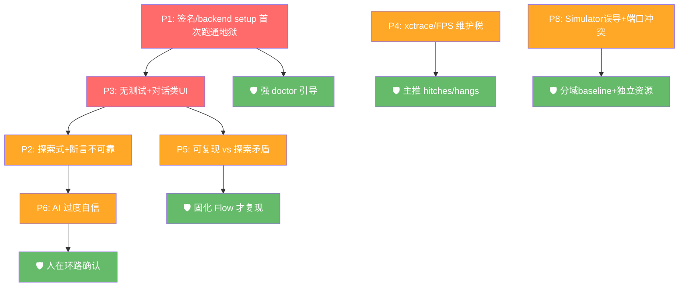

# iTestAgent 开发避坑与关键注意点手册

## 0. 本手册定位

本手册系统性汇总 iTestAgent 开发中**最容易踩的坑与关键注意点**，并给出预防和处理办法。

配套文档：

```
iTestAgent 全量用户故事与验收标准规格书
iTestAgent 架构设计文档
iTestAgent 技术选型文档
iTestAgent 数据流全链路技术说明文档
iTestAgent AI Native 开发理念与实战技巧手册
```

用法：动手前通读“1 顶层红线”和“2 高风险清单”；做具体模块时查对应章节；提交前对照“12 提交前自检清单”。

## 1. 顶层红线（违反必出大问题）

```
R1  不碰 Apple 私有框架（TraceUtility 等）与 .trace 二进制逆向 —— 跨 Xcode 必坏
R2  不自研已复用能力（WDA/Appium/xcodebuild/xctrace/xcresult 解析底座）
R3  不把真机能力“看代码就算过” —— 必须真机 spike 实测
R4  不让“从代码推断的核心链路”当既定事实 —— 只能候选+证据+用户确认
R5  不静默降级/臆造指标（尤其 FPS、xctrace summary）—— 不确定必须显式标注
R6  敏感数据（账号/OTP/token）不落盘明文、不入日志/报告/提交
R7  高风险操作必须二次确认（清数据/卸载重装/写项目/存凭证/更新 baseline）
R8  规格是真理来源 —— AI 或实现与文档冲突时先改文档或纠正实现，不放任漂移
```

## 2. 高风险坑 Top 清单（按杀伤力排序）

```
P1 签名/backend setup 首次跑通地狱       最易让首次使用失败、团队 demo 前夜通宵
P2 探索式测试 + 自动断言不可靠     核心差异化但最不可控，demo 好看生产碎
P3 无测试 + 对话类 UI    路径A失效、定位/断言最难，落在能力最弱象限
P4 xctrace/FPS 跨版本维护税        持续放血，schema 随 Xcode 变
P5 可复现 vs 探索式矛盾            原则要求可复现，探索天然不可复现
P6 AI 过度自信（链路/断言/指标）   产出“看着对但错”的结论，损害信任
P7 绝对索引/长文写入的工具误用     文档/数据写错位（本项目工具链已踩过）
P8 Simulator 性能误导与端口冲突     Simulator 数据被误作真机表现，并行 session 端口/目录冲突
```



## 3. 真机 / 签名 / backend / 设备（P1 重灾区）+ Simulator 坑（ADR-011）

坑与注意点：

```
- WDA 需要有效开发者签名才能装真机；WebDriverAgentRunner 常需单独配 signing team
- 个人 Apple ID free provisioning 7 天过期、bundle id 冲突频发
- Developer Mode(iOS16+) 与设备信任必须手机端手动操作，无法程序化
- devicectl 行为随 Xcode/iOS 版本变化；Xcode 15+ 才是官方路径
- 首次跑通真机通常需要用户配合 15-30 分钟，别假设"自动一把过"
- USB 断连、锁屏、低电量、热节流都会导致偶发失败
- Appium xcodebuild pipeline 在 Xcode 26 + 免费账号下极易失败：
  根本原因：`CODE_SIGN_IDENTITY` 冲突（WDA Lib 硬编码 iOS Development vs Apple Development）、
  xcodebuild CLI 无 Xcode 账号 session、`-allowProvisioningUpdates` 不被 Appium 传递。
  ✅ 解法（ADR-012）：使用 `WdaManager` 自管 WDA 生命周期，通过 `xcodebuild test-without-building -xctestrun <path>`
  绕过 Appium 的 build/install 步骤，Appium 仅用 `usePrebuiltWDA:true + useNewWDA:false` 连接已运行的 WDA。
  G5 真机验证 7/7 PASS 确认此方案可行。
```

Simulator 特有坑（ADR-011）：

```
- simctl 输出格式随 Xcode 版本变化（JSON key 可能增加/改名/移除）
- Simulator runtime 未安装或版本不匹配导致 SDK build 失败
- .app（Simulator）与 .ipa（真机）slice 不可混装
- 并行 Simulator session 需要独立 wdaLocalPort、mjpegServerPort、derivedDataPath
- Simulator 冷启动慢（首次 boot 可能 30-60s）
- Simulator 的 CPU/GPU/内存行为来自 Mac，不能推断真实 iPhone 表现
- Appium/WDA Simulator session 对 Xcode 版本敏感，升级后可能 WDA 编译失败
- simctl erase 会清除所有 App 和用户数据（高风险）
```

预防与处理：

```
- doctor 做成一等公民：诊断 + 逐步引导（签名/DeveloperMode/信任/backend 前置条件）
- backend 依赖预配置/预安装，避免每轮现场 build；缓存并校验版本匹配
- DeviceBackend + 底层工具版本锁定，doctor 校验
- 执行前 healthcheck：连接/信任/DeveloperMode/电量/backend 可用，不满足不进入
- 失败必给"原因+修复步骤"，不静默
- 立项先做"端到端真机 spike"验证签名→backend setup→session→UItree→launch time
- 立项同时做 Simulator spike：simctl lifecycle→Simulator SDK build→Appium/WDA session→UI tree/actions（G5-SIM）
- simctl 输出解析做 JSON fixtures + 多版本 CI 验证
- SessionManager 管理每个 session 的唯一 wdaLocalPort 和 derivedDataPath；同 UDID 串行，不同 UDID 并行
- Simulator 签名/Developer Mode/trust 标记为 N/A；医生 lane 分开展示
```

## 4. 执行路径与断言（P2/P3）

坑与注意点：

```
- 无 XCUITest 项目 -> 路径A空转，全压最弱的路径B（探索式）
- 元素定位依赖 accessibilityIdentifier；SwiftUI/自绘/WebView/对话类 UI 可访问性差
- 中文动态文案、列表复用、动画中间态导致定位 flaky
- 断言推断是研究级问题，自动判 passed 假阳/假阴率高
- 登录/OTP/支付常在第一屏阻断，探索式在首屏就卡住
- 对话类 App 核心是“输入 prompt->流式响应”，通用 UI 断言不适用
```

预防与处理：

```
- 执行前做测试资产探测；无测试自动转 DeviceBackend 探索
- 断言优先级：用户明确条件 > Profile 目标 > Agent 建议(需确认) > 仅探索
- 无明确断言不能判 passed，只能 explored/inconclusive/needs_assertion
- 探索降级为“人在环路录制”：Agent 建议下一步，用户确认，固化 Flow
- 对话类 App 引入专用断言原语：等待流式停止 + 内容非空
- 做元素定位 spike；树残缺则退纯录制模式
```

## 5. 项目分析 / Project Profile（P6 AI 过度自信）

坑与注意点：

```
- 代码里不存在“运行时用户旅程”这条边，静态推断核心链路不可靠
- LLM 会给“自信但常错”的链路，比不给更危险
- sourcekit index 通常需先成功构建生成 index store（依赖签名/构建成功）
- 冷启动索引慢；大项目扫描要控范围
- 误扫 secrets/.gitignore 命中/DerivedData 造成噪声与泄露
```

预防与处理：

```
- 严格区分“确定性字段”（工程结构，可信）与“推断字段”（业务链路，需证据+置信度）
- 核心链路只输出候选 + 证据来源 + confidence，用户 TUI 勾选确认后才生效
- 结构解析用 XcodeProj + xcodebuild -list/-showBuildSettings，不许猜
- 语义用 sourcekit-lsp/SourceKitten；先确保有可用 index
- 明确排除敏感/无关文件；Profile 按 project-hash 缓存，源码变更失效
```

## 6. 性能采集 / .trace / FPS（P4 维护税）

坑与注意点：

```
- 真机无稳定 CLI 实时 FPS；给“精确帧率”会误导
- xctrace export 的 XML schema 跨 Xcode 版本会变；id/ref 解析脆弱
- Xcode 26 引入 Deferred 录制模式，解析要兼容
- 并非所有 GUI 可见数据都能 export（存在 not_exportable）
- memory peak 是采样近似，非权威值
- 自研 trace 解析器会随 Xcode 升级持续被打断
- Simulator 性能数据（CPU/GPU/内存）来自 Mac 宿主，不能推断真实 iPhone 表现
- Simulator xctrace 行为与真机不同（部分 schema 不可用）
```

预防与处理：

```
- 第一版主推 hitches/hangs/launch/memory/crash/duration（相对稳）
- FPS 标 approximate；xctrace summary 深解析为实验性，保留原始 .trace 供人工打开
- 底层用 xctrace export --toc 探测 + --xpath 抽取，schema 名称/列做容错
- 参考 XcodeTraceMCP/instruments-mcp-server/instruments-analyzer，不整包依赖
- 不可导出显式标 not_exportable；memory 标近似；绝不编造
- Simulator 性能数据标注 representativeOfPhysicalDevice=false；baseline 分域隔离
- 用真实 .trace 导出 XML 做 fixture（physical+simulator 双份），未知 schema 走容错分支不崩溃
```

## 7. baseline / 判定（依赖链陷阱）

坑与注意点：

```
- baseline 依赖性能指标质量；指标不稳则趋势无意义
- 用失败/crash 的 run 建 baseline 会污染趋势
- 硬阈值门禁在真机噪声下易误报
- physical 和 simulator baseline 混用会严重误导性能判断
```

预防与处理：

```
- 不要求用户配阈值；首次成功 run 建 baseline，失败/crash run 不建
- 后续与 baseline 对比输出趋势，明确失败仅限 crash/功能失败/执行失败
- 用户可显式接受某次 run 为新 baseline（高风险，需确认）
- baseline key 维度：项目+targetKind+设备型号+iOS+scenario，避免跨设备/跨域混用
- Store/Schema 层拒绝 physical ↔ simulator 跨域 baseline 比较（ADR-011）
- Simulator baseline 必须包含 hostFingerprint、XcodeVersion、runtimeIdentifier
```

## 8. 数据契约 / 报告（漂移与不一致）

坑与注意点：

```
- result.json/artifact-index.json/plan.yaml/project-profile.json 缺 schemaVersion 导致演进困难
- SQLite 存大 artifact 会膨胀；应只存索引
- 敏感字段进 summary/result/日志 造成泄露
- 报告承诺 report.html 等历史遗留会与现状冲突（现状：不出 report.html）
- test-plan/result/flow schema 升级 v2 引入 targetKind 后，v1 数据无 targetKind 字段会造成解析失败
```

预防与处理：

```
- 所有对外产物带 schemaVersion；面向 schema(zod+JSON schema) 编码与测试
- 大文件走文件系统，DB 存指针；result.json 用 artifactRefs 引用
- 每个 run 目录自包含、可独立复现审计
- 报告固定三件套 summary.md/result.json/artifact-index.json，不出 report.html
- v1→v2 reader 将历史数据迁移为 targetKind=physical；新 writer 禁止生成无 targetKind 文档（ADR-011）
- 落盘前脱敏；不可导出/降级项在数据里显式标注
```

## 9. Agent Harness Runtime 编排与权限（自研核心，见 ADR-010）

坑与注意点：

```
- 直接 import/fork OpenCode 编排会踩 private 包 + Effect + SQLite 事件溯源 + coding 语义（见 ADR-010 Harness Runtime 边界）
- 一次性大生成整个循环难以验证
- 子进程(xcodebuild/appium/xctrace)不回收 -> 僵尸进程/资源泄漏
- 权限 ask 阻塞若无超时/取消会卡死会话
```

预防与处理：

```
- 不 import/不 fork，基于 ADR-010 自建 Harness Runtime：AI SDK 多步 tool-calling + MCP tools
- 工具统一 { description, inputSchema, outputSchema, execute } + 输出大小限制
- 先用 mock backend 跑通循环(idle/续跑)，再接真机
- server 统一管理子进程生命周期、信号转发、超时回收
- 权限 allow/deny/ask + 记忆规则；ask 需可取消/超时；高风险默认 ask
- 同设备/session 串行，异设备并发；避免多任务抢同一台真机
```

## 10. 安全与隐私（合规红线）

坑与注意点：

```
- 账号/OTP/token 写进代码/日志/报告/提交
- 记住凭证明文写 JSONC
- 截图/视频含敏感界面外传
- AI 上下文里夹带真实凭证被记录
```

预防与处理：

```
- 真实敏感数据只在内存注入执行，不写 step/日志/报告
- 记住凭证走 macOS Keychain 加密；不写 JSONC 明文
- 日志/报告入库前脱敏；截图/视频仅本地存储 + 提供清理命令
- 默认不写项目目录；写项目/存凭证/生成草稿需二次确认
- 给 AI 的上下文严禁包含真实凭证
```

## 11. AI Native 协作避坑（过程风险）

坑与注意点：

```
- 不给文档上下文，AI 凭想象实现导致偏离规格
- 一次性生成大模块不分步验证
- 接受 AI “看起来对”的链路/断言/指标
- AI 改代码不同步更新文档 -> 规格漂移
- 真机/Simulator 能力不实测仅凭代码通过就宣称完成
```

预防与处理：

```
- 遵循 EPCC-V：Explore->Plan->(人确认)->Code->Check->Verify
- 每个 US = 1 AI 任务，带 AC + 相关文档章节 + schema
- 让 AI 先复述约束再动手；不确定显式标注（诚实降级）
- 真机相关必须真机 spike 验证(G5)；Simulator 相关必须 G5-SIM；纯逻辑用 mock+fixtures
- 有代码变更必须同步更新对应文档，避免漂移
```

## 12. 工具链与本地环境（P7 已实测坑）

坑与注意点：

```
- 文档/数据写入工具用“绝对索引”时分页会写错位（本项目钉钉写入已踩过）
- 超长文本整篇覆盖易被接口拒绝
- Markdown 里 + / . / -> 等符号可能被平台转义，精确匹配失效
- Bun 长任务子进程管理不当造成泄漏
- 第三方 GPL 依赖(如 pymobiledevice3)静态链接污染许可证
```

预防与处理：

```
- 写入定位优先“探针验证落点”再正式写；长文分段追加而非整篇覆盖
- 校验用语义包含而非严格字符串相等，容忍平台转义
- Bun 子进程严格生命周期管理，必要时保留 Node 回退
- GPL/敏感依赖以子进程调用，避免链接进闭源主工程
- 依赖版本锁定(bun.lockb)，CI 与本地一致
```

## 13. 需求边界坑（范围蔓延）

坑与注意点：

```
- 把“研究级能力”当第一版硬门槛（自动链路推断/自动断言/FPS/xctrace summary）
- 19 条 MVP 把“一天的活”和“半年的研究”同权重排期
- 无既有测试项目恰好落在能力最弱象限却按理想路径排期
```

预防与处理：

```
- 采用去风险 MVP：人在环路记录器 + 稳健性能趋势工具
- 研究级项标 Deferred/实验性，不阻塞交付
- 先做多 backend 横评决定路线（端到端真机、元素定位）
- P0 全绿才可交付；P1 允许已知限制但需声明；实验性不作硬门槛
```

## 14. 分阶段避坑重点

```
立项/Spike 阶段
  先验证签名+backend setup 端到端（G5）；Simulator spike（G5-SIM）
  先验证元素可定位性（真机+Simulator 双验证）
  不要先堆功能，先证明真机与 Simulator 链路都能跑通

MVP 阶段
  doctor 引导 + 结构化 Profile + 交互式录制 Flow + 稳健性能子集 + 报告
  避免自动探索/自动断言/FPS 精确/xctrace 深解析作硬门槛

增强阶段
  再上 xctrace 深解析、断言增强、链路推断增强
  始终保持 Local-first、无登录、真机核心不变
```

## 15. 可行性分析

### 总体判断

**有条件可行，但 19 条 MVP 中部分项明显过度承诺。**

```
管道（架构 / 真机+Simulator 执行 / 复用）可行
智能（推断核心链路 / 自动探索+自动断言 / FPS+xctrace summary）高风险
```

### 分维度可行性评级

| 维度                                          | 评级                     |
| --------------------------------------------- | ------------------------ |
| 技术架构（TS/Bun/OpenTUI/AI SDK/MCP/Drizzle） | 可行                     |
| iPhone 真机执行（签名/backend/devicectl）+ iOS Simulator（simctl/Appium）         | 有条件可行，首次摩擦极高 |
| 项目结构识别                                  | 可行                     |
| 从代码推断核心业务链路                        | 高风险，接近不现实       |
| DeviceBackend 自动探索 + 自动断言                | 高风险                   |
| launch/memory/crash/hitches                   | 有条件可行               |
| FPS 精确指标                                  | 高风险，仅能近似         |
| xctrace summary 跨版本稳定解析                | 高风险，持续维护税       |
| 测试数据策略                                  | 可行，设计扎实           |
| repo 复用假设                                 | 多数可行，少数高风险     |

### 19 条 MVP 分档（参考预 ADR-011 分析）

```
确定可做：1 3 4 6 7 16 18
有条件可做：2(降级) 5 8(无既有测试项目 XCUITest 路径无效) 10 12 13 17
研究级/易卡死：9 11 14(FPS+xctrace) 2(链路推断) 15
```

### 去风险 MVP

**重定位：从「全自动 iPhone 测试 Agent」改为「人在环路的真机测试记录器 + 稳健性能趋势工具」。**

第一版保留：
```
TUI + 本地 server + Vercel AI SDK + MCP + Drizzle 骨架
强 doctor：签名 / Developer Mode / 设备信任 / backend 前置条件 引导
Project Analyzer 只做确定性层 + 带证据候选功能 + 用户勾选
Agent 辅助交互式录制：Agent 建议下一步，用户确认/纠偏，固化为可重放 Flow
稳健性能子集：launch + memory(近似) + crash + hitches/hangs
证据采集 + 报告三件套 + 失败解释 + 重跑
测试数据 + Keychain 脱敏
```

明确推迟（标注为实验/尽力而为）：
```
全自动探索 + 自动断言 passed
从代码推断"核心用户链路"
FPS 精确指标 + xctrace summary 稳定解析（第一版只保留原始 .trace + hitches）
XCUITest/Appium 测试代码 draft 生成（标实验性）
```

启动前先做多 backend 横评：
```
1. 端到端真机 spike：构建 + 签名 + backend setup + session + UI tree + 截图 + launch time 全链路跑通
2. 元素定位 spike：实测主界面 accessibility 树质量；若树残缺退纯录制模式
```

## 16. 提交前自检清单

```
[ ] 与规格文档一致，无规格漂移（不一致先改文档）


[ ] 产物过 schema（plan/result/artifact-index/project-profile）


[ ] 类型检查 + Lint 通过


[ ] 单测/集成测试覆盖对应 AC；P0 全绿


[ ] 真机能力已真机 spike 实测（非“看代码就过”）


[ ] 不确定/不可导出/降级项显式标注


[ ] 无敏感数据落盘明文；高风险操作有确认


[ ] 命名统一 itestagent-*，未用 qa-*


[ ] 未自研已复用底座；未碰私有框架/二进制逆向


[ ] 有代码变更已同步更新相关文档
```

## 17. 一页速查（最关键 10 条）

```
1  先做真机 spike(G5) + Simulator spike(G5-SIM)，别先堆功能
2  doctor 是产品能力，不是脚本；首次跑通要引导
3  backend/Xcode/底层工具 版本锁定并校验
4  无测试走探索式，但无断言不判 passed
5  核心链路只给候选+证据，用户确认
6  FPS 近似、xctrace 深解析实验性，主推 hitches/hangs
7  baseline 仅成功 run 建立，失败不建
8  敏感数据只在内存，落盘必脱敏/Keychain
9  高风险操作二次确认，默认不写项目目录
10 AI 产出走 EPCC-V + G1-G7+G5-SIM 门禁，真机/Simulator 必实测
```

## 18. 版本历史与维护声明

| 版本 | 日期 | 变更内容 |
|---|---|---|
| v1.0 | 2026-07-12 | 初始版本，覆盖 R1-R8 顶层红线 + 12 类高风险坑 |
| v1.1 | 2026-07-13 | 新增 R9-R11、可行性分析 §15、分阶段避坑重点 §14、backend 术语对齐 |
| v1.2 | 2026-07-13 | WDA/Appium 引用→backend 统一表述（§3/§9/§13/§15/§17） |
| v1.3 | 2026-07-17 | ADR-011 Simulator 同级支持：新增 P8 风险、Simulator 陷阱（§3）、性能误导（§6）、baseline 分域（§7）、schema 迁移（§8）、G5-SIM 自检（§16）|

本手册与 AGENTS.md、全量规格书协同维护。发现新陷阱或红线变更时，需同步更新本文件对应章节。下次全面复审日期：2026-07-20。